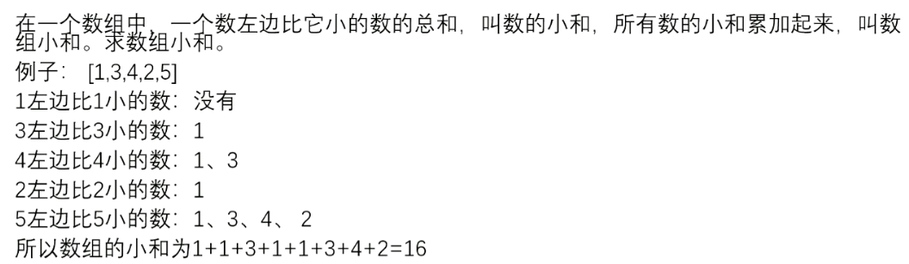
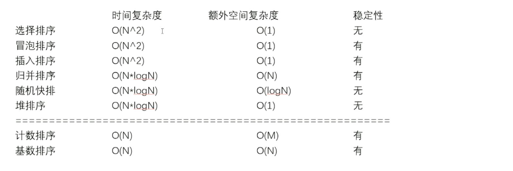
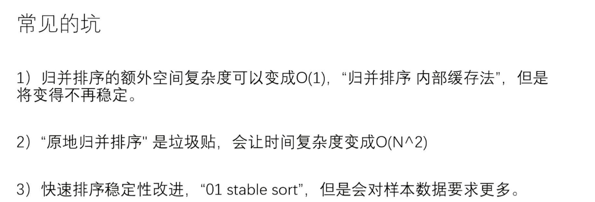

# 排序


# 选择排序

- 时间复杂度(O(N^2))

在 N个数中 遍历N-1次 找到最小的数字和第一个数字交换
在便利N-2个中找到最小的数字和第二个数字交换
循环往复 直到N个数遍历完成

```java
package algorithm;

import java.util.Arrays;

public class selectSort {
    // 选择排序 第i个位置存放第i位序列
    public static int tempSize = 20; // 测试多少组数据的长度
    public static int tempValue = 30; // 数据的值在哪个范围
    public static int tempTime = 100; // 比较多少组数据

    public static void selectSort(int[] arr) {
        if (arr == null) {
            return;
        }

        for (int i = 0; i < arr.length; i++) { // 循环次数
            int minValue = i; // 比较值
            for (int j = i + 1; j < arr.length; j++) {
                if (arr[minValue] > arr[j]) {
                    minValue = j;
                }
            }
            swap(arr, i, minValue);
        }
    }

    public static void swap(int[] arr, int i, int j) {
        int temp = arr[i];
        arr[i] = arr[j];
        arr[j] = temp;
    }

    public static void sort(int[] arr) {
        Arrays.sort(arr);
    }

    public static boolean isEqual(int[] arr, int[] arr2) {
        if ((arr == null && arr2 != null) || (arr != null && arr2 == null)) {
            return false;
        }
        if (arr == null) {
            return true;
        }
        if (arr.length != arr2.length) {
            return false;
        }
        for (int i = 0; i < arr.length; i++) {
            if (arr[i] != arr2[i]) {
                return false;
            }
        }
        return true;
    }

    public static int[] generator(int size, int value) {
        int[] arr = new int[(int) ((Math.random() + 1) * size)];
        for (int i = 0; i < size; i++) {
            //            [-value,value]
            arr[i] = ((int) (Math.random() * (value + 1)) - (int) (Math.random() * value));
        }
        return arr;
    }

    // 拷贝数组
    public static int[] copyArray(int[] array) {
        // 引用数据类型 都可以为null
        if (array == null) {
            return null;
        }
        int[] tempArray = new int[array.length];
        for (int i = 0; i < array.length; i++) {
            tempArray[i] = array[i];
        }
        return tempArray;
    }

    public static void printf(int[] a, int[] b, int[] c) {
        for (int i = 0; i < a.length; i++) {
            System.out.println("排序值,sort值,初始值");
            System.out.printf("%d,%d,%d", a[i], b[i], c[i]);
            System.out.println();
        }
    }

    public static void main(String[] args) {
        for (int i = 0; i < tempTime; i++) {
            int[] arr = generator(tempSize, tempValue);
            int[] arr1 = copyArray(arr);
            int[] arr2 = copyArray(arr);
            selectSort(arr1);
            sort(arr2);
            if (!isEqual(arr1, arr2)) {
                printf(arr1, arr2, arr);
                return;
            }
        }
        System.out.println("ok");
    }
}

```


# 冒泡排序

- 时间复杂度O(N^2)

比较两个相邻的数字的结果 判断是否要交换顺序 (一轮下来的时间复杂度是O(N))
&#x20;以此重复 知道所有排序完成

```java
package algorithm;

import java.util.Arrays;

public class bubblingSort {
    //  冒泡排序
    public static int tempSize = 20; // 测试多少组数据的长度
    public static int tempValue = 10; // 数据的值在哪个范围
    public static int tempTime = 50; // 比较多少组数据

    // 比较两个相邻的元素，将值大的元素交换到右边
    // 时间复杂度O(n^2)
    public static void bubblingSort(int[] arr) {
        if (arr == null || arr.length < 2) { // 注意边界问题
            return;
        }
        for (int i = 0; i < arr.length - 1; i++) { // 循环次数
            // 每次循环都会确定i+1个排序 所以要 arr.length - (i + 1)
            // 注意这里的arr.length - i -1
            for (int j = 0; j < arr.length - i - 1; j++) {
                // 这里的
                if (arr[j] > arr[j + 1]) {
                    swap(arr, j, j + 1);
                }
            }
        }
    }

    public static void sort(int[] arr) {
        Arrays.sort(arr);
    }

    // 交换顺序
    public static void swap(int[] arr, int i, int j) {
        int temp = arr[i];
        arr[i] = arr[j];
        arr[j] = temp;
    }

    // 生成随机数组
    public static int[] generateRandomArray(int size, int value) {
        // 生成size长度的数组 并且值在 [0-value - 1] 之间
        int[] array = new int[(int) ((Math.random() + 1) * size)];
        for (int i = 0; i < array.length; i++) {
            array[i] = (int) (Math.random() * value);
        }
        return array;
    }

    // 拷贝数组
    public static int[] copyArray(int[] array) {
        // 引用数据类型 都可以为null
        if (array == null) {
            return null;
        }
        int[] tempArray = new int[array.length];
        for (int i = 0; i < array.length; i++) {
            tempArray[i] = array[i];
        }
        return tempArray;
    }

    public static boolean isEqual(int[] arr, int[] rightArray) {
        if (arr == null && rightArray != null || arr != null && rightArray == null) {
            return false;
        }
        if (arr == null) {
            return true;
        }
        if (arr.length != rightArray.length) {
            return false;
        }
        for (int i = 0; i < arr.length; i++) {
            if (arr[i] != rightArray[i]) {
                return false;
            }
        }
        return true;
    }

    public static void printf(int[] a, int[] b, int[] c) {
        for (int i = 0; i < a.length; i++) {
            System.out.println("排序值,sort值,初始值");
            System.out.printf("%d,%d,%d", a[i], b[i], c[i]);
            System.out.println();
        }
    }

    public static void main(String[] args) {
        for (int i = 0; i < tempTime; i++) {
            int[] arr = generateRandomArray(tempSize, tempValue); // 第一组数据
            int[] rightArray = copyArray(arr); // 拷贝一组数组 用于比较
            int[] tempArray = copyArray(arr); // 拷贝一组数组 用于比较
            bubblingSort(arr);
            sort(rightArray);
            // 比较是否两个相等
            if (!isEqual(arr, rightArray)) {
                printf(arr, rightArray, tempArray);
                return;
            }
        }
        System.out.println("ok");
    }
}

```


# 插入排序

- 时间复杂度O(N^2)

将第i位的元素插入到前0- (i-1) 中去

```java
package algorithm;

import java.util.Arrays;

public class insertSort {
    // 插入排序 i>=1  从小到大
    // 将第i位的元素插入到前0- (i-1) 中去
    public static int tempSize = 20; // 测试多少组数据的长度
    public static int tempValue = 100; // 数据的值在哪个范围
    public static int tempTime = 1000; // 比较多少组数据

    // 时间复杂度O(n^2)
    public static void insertSort(int[] arr) {
        if (arr == null || arr.length < 2) { // 注意边界问题
            return;
        }
        for (int i = 1; i < arr.length; i++) {
            for (int j = 0; j < i; j++) {
                if (arr[j] > arr[i]) {
                    // 往后移动一位
                    move(arr, j, i);
                }
            }
        }

    }

    public static void sort(int[] arr) {
        Arrays.sort(arr);
    }

    // 插入 往后位移 从i到j位往后移
    public static void move(int[] arr, int i, int j) {
        // 数据移动是从 [i,j)
        int tampValue = arr[j];
        for (int k = j - 1; k >= i; k--) {
            arr[k + 1] = arr[k];
        }
        arr[i] = tampValue;
    }

    // 生成随机数组
    public static int[] generateRandomArray(int size, int value) {
        // 生成size长度的数组 并且值在 [0-value - 1] 之间
        int[] array = new int[(int) ((Math.random() + 1) * size)];
        for (int i = 0; i < array.length; i++) {
            array[i] = (int) (Math.random() * value);
        }
        return array;
    }

    // 拷贝数组
    public static int[] copyArray(int[] array) {
        // 引用数据类型 都可以为null
        if (array == null) {
            return null;
        }
        int[] tempArray = new int[array.length];
        for (int i = 0; i < array.length; i++) {
            tempArray[i] = array[i];
        }
        return tempArray;
    }

    public static boolean isEqual(int[] arr, int[] rightArray) {
        if (arr == null && rightArray != null || arr != null && rightArray == null) {
            return false;
        }
        if (arr == null) {
            return true;
        }
        if (arr.length != rightArray.length) {
            return false;
        }
        for (int i = 0; i < arr.length; i++) {
            if (arr[i] != rightArray[i]) {
                return false;
            }
        }
        return true;
    }

    public static void printf(int[] a, int[] b, int[] c) {
        for (int i = 0; i < a.length; i++) {
            System.out.println("排序值,sort值,初始值");
            System.out.printf("%d,%d,%d", a[i], b[i], c[i]);
            System.out.println();
        }
    }

    public static void main(String[] args) {
        for (int i = 0; i < tempTime; i++) {
            int[] arr = generateRandomArray(tempSize, tempValue); // 第一组数据
            int[] rightArray = copyArray(arr); // 拷贝一组数组 用于比较
            int[] tempArray = copyArray(arr); // 拷贝一组数组 用于比较
            insertSort(arr);
            sort(rightArray);
            // 比较是否两个相等
            if (!isEqual(arr, rightArray)) {
                printf(arr, rightArray, tempArray);
                return;
            }
        }
        System.out.println("ok");
    }
}
```


# 快速排序

```java
import java.util.Arrays;

public class quickSort {
    /**
     * 快速排序
     * 时间复杂度nlogn
     * @param arr
     * @desc 选择一个基准数，通过一趟排序将要排序的数据分割成独立的两部分；
     * 其中一部分的所有数据都比另外一部分的所有数据都要小。然后，再按此方法对这两部分数据分别进行快速排序，
     * 整个排序过程可以递归进行，以此达到整个数据变成有序序列。
     */
    public static void quickSort(int[] arr) {
        if(arr == null || arr.length < 2) return;
        int pre = 0; //左边界
        int next = arr.length -1; //右边界
        quickSortStack(arr,pre,next);
    }
    public static void quickSortStack(int[] arr,int i, int j) {
        if(i >= j) return;
        int current = arr[i]; //基准值
        // 保存边界值
        int pre = i;
        int next = j;
        while(pre < next) {
            // 如果 next的值比当前的值大 则继续往下查找
            while(pre < next && arr[next] >= current) {
                next--;
            }
            // 这里会走 arr[next] < current 交换顺序
            if(pre < next) {
                arr[pre] = arr[next];
                //之后往pre向上走判断
                pre++;
                // 之后next这个数字就是基准值下标了
            }
            // pre的值比当前基准值小
            while(pre < next && arr[pre] <= current) {
                pre++;
            }
            // arr[pre] > current
            if(pre < next) {
                arr[next] = arr[pre];
                next--;
                // 之后pre这个数字就是基准值下标了
            }
        }
        // 结束后 pre = next 基准值放于中间
        arr[pre] = current;
        quickSortStack(arr,i,pre-1);
        quickSortStack(arr,pre+1,j);
    }
    public static void sort (int[] arr) {
        Arrays.sort(arr);
    }
    public static void swapArray(int[] arr,int a,int b) {
        if(a == b) return;
        arr[a] = arr[a] ^ arr[b];
        arr[b] = arr[a] ^ arr[b];
        arr[a] = arr[a] ^ arr[b];
    }
    public static boolean isEqual(int[] arr, int[] sort) {
        if((arr == null && sort !=null) || (arr != null && sort == null)) {
            return false;
        }
        if(sort == null) {
            return true;
        }
        if(arr.length != sort.length) {
            return false;
        }
        for (int i = 0; i < arr.length; i++) {
            if(arr[i] != sort[i]) {
                return false;
            }
        }
        return true;
    }
    public static int[] tempNumber(int size,int result) {
        int[] arr = new int[size];
        for (int i = 0; i < size; i++) {
            arr[i] = ((int)((Math.random() *result) + 1) - (int)(Math.random() * result));
        }
        return arr;
    }
    public static int[] copyArr(int[] arr) {
        int[] copyArr = new int[arr.length];
        for (int i = 0; i < arr.length; i++) {
            copyArr[i] = arr[i];
        }
        return copyArr;
    }
    public static void systemOut(int[] arr, int[] sortArr, int[] tempArr) {
        for (int i = 0; i < arr.length; i++) {
            System.out.printf("arr:%d,sortArr:%d,tempArr:%d",arr[i],sortArr[i],tempArr[i]);
            System.out.println();
        }
    }
    public static void main(String[] args) {
        int tempSize = 2; //比较次数
        int size = 10;// 数组长度
        int result = 50;
        for (int i = 0; i < tempSize; i++) {
            int[] resultArr = tempNumber(size,result);
            int[] sortArr = copyArr(resultArr);
            int[] tempArr = copyArr(resultArr);
            quickSort(resultArr);
            sort(sortArr);
            if(!isEqual(resultArr,sortArr)) {
                systemOut(resultArr,sortArr, tempArr);
                return;
            }
        }
        System.out.println("ok");
    }
}
```


# 归并排序

> 适合用于查找一部分降序对的问题 （即 右边的数字哪些比当前数字小 哪些数字比当前数字大）

```java
/**
 * 归并排序
 * 采用分治策略
 * 分治法将问题分(divide)成一些小的问题然后递归求解，
 * 而治(conquer)的阶段则将分的阶段得到的各答案"修补"在一起，即分而治之
 * 从局部有序 到整体有序
 * @see: https://www.cnblogs.com/chengxiao/p/6194356.html
 * 代码优化：开辟一个等长的数组
 * 时间复杂度 n logN
 */
public class mergeSort {
    private int[] arr;

    public void sort(int[] arr) {
        if (arr == null || arr.length == 1) {
            return;
        }
        int pre = 0; // 数组前置指针
        int next = arr.length - 1; // 数组后置指针
        this.arr = arr;
        int[] templateArray = new int[arr.length];
        mergeSortDemo(pre, next, templateArray);
    }

    public void mergeSortDemo(int pre, int next, int[] templateArray) {
        if (pre == next) {
            // 相等时唯一自然有序
            return;
        }
        // 将数组拆分成更小的例子去求解
        int middle = pre + ((next - pre) >> 1);
        mergeSortDemo(pre, middle, templateArray);
        mergeSortDemo(middle + 1, next, templateArray);
        // 进行数组合并 使其短暂变成有序
        merge(pre, middle, middle + 1, next, templateArray);
    }

    /**
     * pre-middle表示一个数组 nextMiddle-next也表示一个数组
     *
     * @param pre
     * @param middle
     * @param nextMiddle
     * @param next
     */
    public void merge(int pre, int middle, int nextMiddle, int next, int[] templateArray) {
        // 表示两个数组
        int i = pre; //表示pre数组的指针
        int j = nextMiddle; // 表示nextMiddle数组的指针
        //TODO： new一个与原数组相同长度的数组 可以在递归中不必频繁开辟空间

        //  int[] tempArr = new int[next - pre + 1]; //暂存数组
        int index = 0;
        while (i <= middle && j <= next) {
            if (this.arr[i] <= this.arr[j]) {
                templateArray[index++] = this.arr[i++];
            } else {
                templateArray[index++] = this.arr[j++];
            }
        }
        while (j <= next) {
            templateArray[index++] = this.arr[j++];
        }
        while (i <= middle) {
            templateArray[index++] = this.arr[i++];
        }
        copyArr(this.arr, templateArray, pre, next);
    }

    public void copyArr(int[] arr, int[] tempArr, int i, int j) {
        int index = 0;
        for (int k = i; k <= j; k++) {
            arr[k] = tempArr[index++];
        }
    }

    public static void main(String[] args) {
        int[] arr = new int[]{8, 4, 5, 7, 1, 3, 6, 2};
        mergeSort m = new mergeSort();
        m.sort(arr);
        System.out.println(arr);
    }

    /**
     * 始终每组都要确定 pre 前置下标 m(middle) 中间下标 next 末尾下标
     *
     * @param arr
     */
    public void whileToMerge(int[] arr) {
        this.arr = arr;
        int[] tempArray = new int[arr.length];
        int mergeSize = 1; // mergeSize 代表组的个数  开始为1是因为不能保证如果以2为组不确定是否有序
        // 例如 21 23 如果开始以2为一组 则第一组无序
        while (mergeSize < arr.length) {
            int l = 0; //标识下标作用
            while (l < arr.length) {
                int m = l + mergeSize - 1; // 标识一组的长度 因为l是下标 mergeSize表示的长度
                if (m >= arr.length) {//大于等于数组的长度说明他可以是最后一位或者已经越界了 不需要在归并 因为在更小的事件中已经归并好了
                    break;
                }
                int R = Math.min(m + mergeSize, arr.length - 1);// 判断最后一组的下标是否越界 越界取边界
                merge(l, m, m + 1, R, tempArray);
                l = R + 1; // l指向下一组的0位置
                //防止数据过大 内存溢出
                if (mergeSize > (arr.length / 2)) {
                    break;
                }
                mergeSize <<= 1;
            }
        }
    }
}

```



# 堆排序

先让整个数组都变成大根堆结构 建立堆的过程&#x20;
把堆的最大值和堆末尾的值交换 然后减少堆的大小之后 再去调整堆 一直周而复始 时间复杂度为O(N* lgN)
堆的大小减少为0之后 排序完成

> heapify 是将index从上而下变成一个大根堆(小根堆也是一样实现)
> heapInsert是从下往上变成一个大根堆

```java
package com.xchen.sort;

/**
 * 堆排序
 */

public class HeapSort {

    /**
     *
     * @param arr   需要变成大根堆的数组
     * @param index 当前需要检测的下标
     */
    public static void heapInsert(int[] arr, int index) {
        while (arr[index] > arr[(index - 1) / 2]) {
            swap(arr, index, (index - 1) / 2);
            index = (index - 1) / 2;
        }
    }

    /**
     * 在index 到 heapSize 变成大根堆[index-heapSize]
     * 从index位置往下调整
     * @param arr
     * @param index
     * @param heapSize
     */

    public static void heapify(int[] arr, int index, int heapSize) {
        int left = 2 * index + 1;
        // heapSize为 1 则 left == left
        // left < heapSize 表示左孩子下标不会越界的同时右孩子也不会越界 如果等于 右孩子会越界
        while (left < heapSize) {
            int largest = arr[left] > arr[left + 1] || left + 1 > heapSize ? left
                    : left + 1;
            if (arr[largest] > arr[index]) {
                swap(arr, index, largest);
            } else
            {
                return;
            }
            index = largest;
            left = 2 * index + 1;
        }
    }

    public static void heapSort(int[] arr) {
        // 现将他变成大根堆 或者小根堆
        //        for (int i = 0; i < arr.length; i++) {
        //            heapInsert(arr, i);
        //        }
        // 上述代码优化 O(N)
         for (int i = arr.length - 1; i >= 0; i--) {
             heapify(arr, i, arr.length - 1);
         }
        int heapSize = arr.length;
        swap(arr, 0, --heapSize);
        while (heapSize > 0) {
            // heapSize大于0的时候 每次推出最大的值
            // 在外面先swap 保证while 每次只减1 保证数组不越界
            //TODO: 这里应该每次都要减去一以保证交换数组值
            heapify(arr, 0, heapSize - 1);
            swap(arr, 0, --heapSize);
        }
    }

    // 交换顺序
    public static void swap(int[] arr, int i, int j) {
        if (i == j)
            return;
        arr[i] = arr[j] ^ arr[i];
        arr[j] = arr[j] ^ arr[i];
        arr[i] = arr[j] ^ arr[i];
    }

    public static void main(String[] args) {
        int[] arr = {1,3,2,6,2,1,3,4};
        heapSort(arr);
        System.out.println(arr);
    }
}
```


# 桶排序

最多的实现为计数排序 桶排序的思想下的排序都是不基于比较的排序
时间复杂O(N) 空间复杂度为O(M)
需要样本的数据在一定的确定的范围内 可以满足桶(容器)的划分


# 基数排序

> 一般由非负十进制
> 给各个进制排序 按照从左到右以各个进制排序 入桶 然后排序完后出桶

O(N * lg10^N)

```java
package com.xchen;

public class CountTheOrder {
    /**
     * 计数排序
     * 先要计算数字的最大个数 然后最高位不足的以0补齐
     */
    public static void CountOrder(int[] number) {
        if (number == null || number.length < 2) return;
        radixSort(number, 0, number.length - 1, maxBits(number));
    }

    /**
     * 排序
     *
     * @param arr
     * @param prefix
     * @param end
     * @param length
     */
    public static void radixSort(int[] arr, int prefix, int end, int length) {
        final int radix = 10;
        for (int i = 0; i < length; i++) {
            // 准备一个count数组 0-9 存储进制位上的数字的个数
            // 之后转成count`数组 保存的是进制位上的小于等于i的个数
            // 之后从数组从右往左遍历 因为在桶中 所以可以确定当前进制位最后出来的个数放在哪一位上
            int[] count = new int[radix]; // 0-9的数组 用于保存存的是进制位上的小于等于i的个数
            int[] help = new int[arr.length]; //辅助数组
            for (int j = prefix; j <= end; j++) {
                // 统计存储进制位上的数字的个数
                count[getRadixNumber(arr[j], i + 1)]++;
            }
            for (int j = 1; j < radix; j++) {
                // 保存的是进制位上的小于等于i的个数
                count[j] += count[j - 1];
            }

            for (int j = end; j >= prefix; j--) {
                int index = getRadixNumber(arr[j], i + 1);
                // 表示的是从右往左遍历 从count可以得知在index上有几个数字小于等于这个进制的 然后将arr[index]插入到末尾
                help[count[index] - 1] = arr[j];
                // 记住个数也要随着减少
                count[index]--;
            }

            //至此一轮排序完成 因为arr是在prefix-end上排序的 归位也是在prefix-end上
            for (int j = 0, k = prefix; k <= end; j++, k++) {
                arr[k] = help[j];
            }
        }
    }

    /**
     * 获取进制位上特定的数字
     */
    public static int getRadixNumber(int number, int radix) {
        int num = 1;
        int result = number;
        while (num < radix) {
            result = result / 10;
            if (result == 0) {
                return 0;
            }
            result = result / 10;
            num++;
        }
        return result % 10;
    }

    public static int maxBits(int[] numbers) {
        int max = 0, number = 0;
        for (int i = 0; i < numbers.length; i++) {
            max = Math.max(max, numbers[i]);
        }
        while (max != 0) {
            number++;
            max = max / 10;
        }
        return number;
    }
}

```


# 计数排序


# 排序稳定性

选择排序 -无
冒泡排序 -有
插入排序 -有
归并排序 -如果合并的时候交换的是左边的 稳定性不会破坏
快速排序 -无 稳定性会被破坏
堆排序 -无


> 稳定 归并排序 额外空间 堆排序 绝对时间 快排


