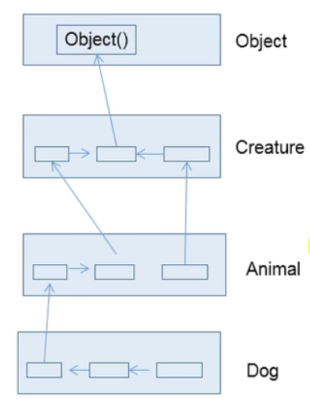

父类super指向父类 可以调用父类的方法
(**类优先会在自己内部先寻找属性和方法 如果找不到在找父类的属性和方法**)

1. 当子类在方法和构造器中 通过super.属性或者super.方法的方式会显示的调用父类声明的属性或者方法 通常情况下会省略super.(关于调用成员变量和成员方法而不是静态变量和静态方法的原因： 类的继承并不继承静态变量和静态方法(static))
2. 在子类的方法和构造器中 如果使用了this.属性或者方法 则优先在子类中寻找 如果子类没有找到 则会去父类中寻找...
3. 关于子类重写父类的方法 或者子类定义了父类同名的属性的时候 **需要显示调用super.**

## super在构造器中

可以在子类中显示的使用super(形参列表)的方式，调用父类中声明的指定的构造器
super(形参列表) 的使用，声明在首航
类的构造器中 this() 或者 super() 只能二选一 不能同时出现
如果没有显式声明this(形参列表) 或 super(形参列表) 则默认调用的是父类中空参的构造方法
**在类中的多个构造器中 至少有一个类的构造器中使用了super(形参列表) 调用父类中的构造器（因为只有n-1个this 剩下的一个就是super）**

