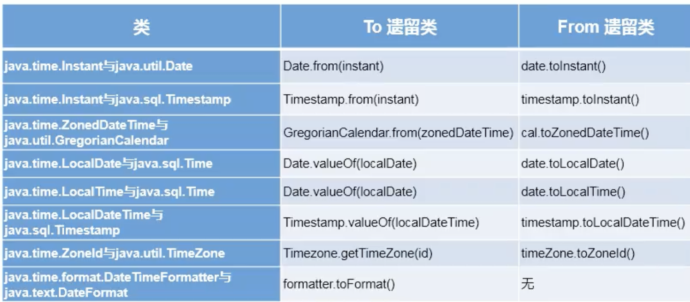
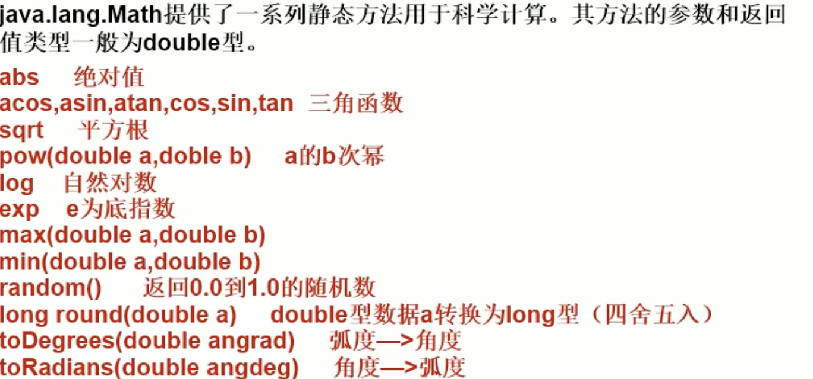
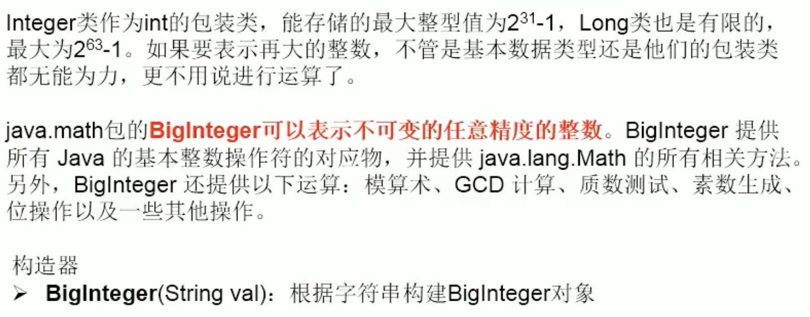

## Scanner类库

```java
import java.util.Scanner; //导入Scanner的类库
public class ScannerTest {
    public static void main(String[] args) {
        Scanner scan = new Scanner(System.in);
        int num = scan.nextInt(); // 输入一个int的值
        System.out.println(num);
    }
}
```

- next() string
- nextInt int
- nextDouble double
- nextBoolean boolean

## Arrays

- boolean equals(int\[] a,intp\[] b) 判断两个数组是否相等
- String toString(int\[] a) 输出数组信息
- String

# System

- System.exit(0) 调用方法退出进程 0正常退出
- System.out.println()  输出并且换行
- void gc（） 请求系统进行垃圾回收
- getProprety（String key） 获取key对应的值
  - java.version java运行时的版本
  - java.home java安装目录
  - os.name 操作系统的名称
  - os.version 操作系统的版本
  - user.name 用户的账户名称
  - user.home 用户的主目录
  - user.dir 用户的当前工作目录

# String

> 执行效率 StringBuilder > StringBuffer > String

String 是一个final类 不可被继承
String实现了Serializable 支持序列化&#x20;
实现了Comparable接口 支持比较
String 内部实现了 final char\[] value;
&#x20;保证了字符串的不可变的字符序列

```java
public final class String
    implements java.io.Serializable, Comparable<String>, CharSequence {
```


## 字面量的定义方式

```java
public static void main(String[] args) {
        String s1 = "123";
        String s2 = "123";
        System.out.println(s1 == s2); // true
    }
```

**字面量声明的字符串会在字符串的常量池中**

## String的赋值

```java
String s1 = "123"; //字面量赋值
String s2 = new String("123"); //new 对象赋值
```


## String的构造函数

```java
new String(char[] arrary,int startIndex,int count);
new String(String str);
new String(char[] array);
```


## String 内存空间

> 常量与常量的拼接结果在常量池 且常量池中不会存阿紫啊相同内容的常量
> 只要其中一个是变量 结果就在堆内存中
> String intern(); //返回值一定是常量池的字符串

```java
package main.com.xchen.javaDemo.commonClass;

/**
 * @author: xchen
 * @createTime: 2022-01-30 16:57:56
 * @description: String 常用类
 */
public class StringClass {
    public static void main(String[] args) {
        /**
         * 只要有变量参与运算 都在堆内存中开辟内存空间
         */
        String s1 = "123"; //字面量赋值
        String s2 = "456";
        String s3 = "123456";
        String s7 = "123" + "456";
        String s4 = s1 + "456";
        String s5 = "123" + s2;
        String s6 = s1 + s2;
        String s8 = s3.intern(); //返回值一定是常量池的字符串
        System.out.println(s7 == s3); //true
        System.out.println(s3 == s4); // false
        System.out.println(s3 == s5); // false
        System.out.println(s3 == s6); // false
        System.out.println(s4 == s5); // false
        System.out.println(s4 == s6); // false
        System.out.println(s5 == s6); // false

    }
}
```


## 字符串常量池的位置

JDK1.6 在方法区(永久存储区)
JDK1.7 存放在堆中
JDK1.8 在方法区（元空间）

## String的方法

length
isEmpty
concat 等价于用 "+"
equalsIgnoreCase 比较相等忽略大小写
contains
indexOf
replaceAll(regex,regexment) //正则替换
tocharArray()

> char\[] charArray 如果转换成字符串 使用 String的构造器
> String => byte\[] 调用对象的方法 getBytes()

注意 final 表示的是一个常量

```java
        String s3 = "123456";
		final String s9 = "123"; //常量
        String s10 = s9 + "456";
        System.out.println(s10 == s3);
```


# StringBuffer

可变的字符序列 效率会比StringBuilder 低一些 因为他都是线程同步的方法 线程安全 （方法都多了一个synchronized ）

> 底层使用char\[] 存储


## 常用方法

append()
delete(int start, int end) 左闭右开
replace（int start，int end， string str） 把\[start,end) 替换为str
insert（int offset， xxx） 在指定位置插入xxx
reverse 反转
indexOf
substring
length
charAt
setCharAt（int n , char ch）

# StringBuilder

可变的字符序列 线程不安全

> 底层使用char\[] 存储


# String StringBuffer StringBuilder 源码解析

```java
String str = new String();
// 相当于在 final char[] value = new char[0];
String str1 = new String("abc")
// 相当于 final char[] value = new char[]{'a','b','c'}

StringBuffer s1 = new StringBuffer();
// char[] value = new char[16]; // 底层创建了一个长度为16的char型数组
s1.append('a'); // value[0] = 'a'

StringBuffer s1 = new StringBuffer("abc");
// new char["abc".length + 16]

// append执行的方法：
public synchronized StringBuffer append(String str) {
        toStringCache = null;
    // 调用父级的append
        super.append(str);
        return this;
    }
 public AbstractStringBuilder append(String str) {
        if (str == null) {
            // 放置添加空指针
            return appendNull();
        }
        int len = str.length();
     // 确保长度是否够 不够进行扩容
        ensureCapacityInternal(count + len);
     // 将字符串插入到末尾
        putStringAt(count, str);
     // length 增加 调用的 s1.length 返回的就是count
        count += len;
        return this;
}

 private void ensureCapacityInternal(int minimumCapacity) {
        // overflow-conscious code
        int oldCapacity = value.length >> coder;
        if (minimumCapacity - oldCapacity > 0) {
            value = Arrays.copyOf(value,
                    newCapacity(minimumCapacity) << coder);
        }
    }

private int newCapacity(int minCapacity) {
        // overflow-conscious code
        int oldCapacity = value.length >> coder;
    // 每次扩容（新的容量）都是 上一次的容量 * 2 + 2
        int newCapacity = (oldCapacity << 1) + 2;
        if (newCapacity - minCapacity < 0) {
            // 如果扩容的（新的）容量还是比最小的（minCapacity）要小 则直接取最小容量（minCapacity）
            newCapacity = minCapacity;
        }
        int SAFE_BOUND = MAX_ARRAY_SIZE >> coder;
    //边界溢出处理
        return (newCapacity <= 0 || SAFE_BOUND - newCapacity < 0)
            ? hugeCapacity(minCapacity)
            : newCapacity;
    }

private AbstractStringBuilder appendNull() {
        ensureCapacityInternal(count + 4);
        int count = this.count;
        byte[] val = this.value;
        if (isLatin1()) {
            val[count++] = 'n';
            val[count++] = 'u';
            val[count++] = 'l';
            val[count++] = 'l';
        } else {
            count = StringUTF16.putCharsAt(val, count, 'n', 'u', 'l', 'l');
        }
        this.count = count;
        return this;
    }
```


# 方法链的原理

用append举例：

```java
 public AbstractStringBuilder append(String str) {
        if (str == null) {
            // 放置添加空指针
            return appendNull();
        }
        int len = str.length();
     // 确保长度是否够 不够进行扩容
        ensureCapacityInternal(count + len);
     // 将字符串插入到末尾
        putStringAt(count, str);
     // length 增加 调用的 s1.length 返回的就是count
        count += len;
        return this;
}

// 因为return了 this 则可以一直append

StringBuffer s1 = new StringBuffer();
s1.append("a").append("b");
```


# JDK8 之前的时间API

计算世界时间的主要标准

- UTC Coordinated Universal Time
- GMT Greenwich Mean Time
- CST Central Standard Time
- ISO-8601

java.lang.System类
java.util.Date类

```java
Date date  = new Date();

date.toString() // Tue Feb 01 16:14:42 CST 2022
// 第二种构造 获取指定时间戳的对象
    Date date  = new Date(new Date().getTime());
```

java.sql.Date对象

> java.sql Date类 继承 java.util.Date
> Date对象的偏移量 Date的年份从1900年开始 而月份都是从0月开始

```java
java.sql.Date date = new java.sql.Date(new Date().getTime());
```


## 8.0之后的simpleDateFormat类

date类的api不易国际化 大部分被废弃了  java.text.SimpleDateFormat类是一个不与语言环境有关的方式来格式化和解析日期的具体类
允许进行格式化：日期 => 文本   允许解析 文本 => 日期

```sql
 public static void main(String[] args) {
        SimpleDateFormat simpleDateFormat = new SimpleDateFormat("yyyy-MM-dd HH:mm:ss");
        Date date = new Date();
        System.out.println("simpleDateFormat.format(date) = " + simpleDateFormat.format(date));
        try {
            simpleDateFormat.parse("2022-02-03 20:36:28");
        } catch (Exception e) {
            e.printStackTrace();
        }
    }
```


# Calendar  日历类


## 实例化对象

1. 调用 public static getInstance 方法

```java
Calendar calendar = Calendar.getInstance();
        System.out.println(calendar.getClass());
// class java.util.GregorianCalendar
```

2. 实例化子类对象

```java
GregorianCalendar gregorianCalendar = new GregorianCalendar();
```


## 常用方法

- get
- set
- add
- getTime
- setTime

```java
 public static void main(String[] args) {
        Calendar calendar = Calendar.getInstance();
        int day = calendar.get(Calendar.DAY_OF_MONTH); // 这个月的第几天
        int year = calendar.get(Calendar.DAY_OF_YEAR); // 这年的第几天
        calendar.set(Calendar.DAY_OF_MONTH,15);
        int day1 = calendar.get(Calendar.DAY_OF_MONTH);
        System.out.println(day1);
        calendar.add(Calendar.DAY_OF_MONTH, 5);
        int day2 = calendar.get(Calendar.DAY_OF_MONTH);
        System.out.println(day2);
        // 日历类 => Date
        System.out.println("calendar.getTime() = " + calendar.getTime());
        // Date => 日历类
        calendar.setTime(new Date());
        System.out.println(calendar.get(Calendar.DAY_OF_MONTH));
    }
```

> 注意 获取月份的时候 一月是0 获取星期的时候 周日是1  周六是7


# JDK8新日期时间API

使用java.time java.time.format包

- LocalDate
- LocalTime
- LocalDateTime 使用频率高

```java
@Test
    public void LocalClass() {
        System.out.println(LocalDate.now()); //        2022-02-03
        System.out.println(LocalTime.now()); //        23:03:33.258334
        System.out.println(LocalDateTime.now());//        2022-02-03T23:03:33.258386

        // LocalDateTime.of() 设置的时间 不会有偏移量的问题
        System.out.println(LocalDateTime.of(2020,6,13,0,0)); //2022-02-03T23:06:36.633951

        // LocalDateTime 的 构造函数 private
        LocalDateTime localDateTime = LocalDateTime.of(2022,6,13,0,0);
        System.out.println(localDateTime.getDayOfMonth());
        System.out.println(localDateTime.getDayOfWeek());
        System.out.println(localDateTime.getDayOfYear());
        System.out.println(localDateTime.getHour());
        System.out.println(localDateTime.getMinute());
        System.out.println(localDateTime.getMonthValue());
        System.out.println(localDateTime.getSecond());
    }
```

> getXxxx()获取值 withXxx() 设置值

```java
   public void LocalClass() {
        LocalDate localDate = LocalDate.now();
        LocalDate localDate1 = localDate.withDayOfYear(35);
        System.out.println(localDate); // 2022-02-03
        System.out.println(localDate1); // 2022-02-04
        LocalTime localTime  = LocalTime.now();
        LocalTime localTime1 = localTime.withHour(12);
        System.out.println(localTime); //23:20:02.611
        System.out.println(localTime1); //12:20:02.611
    }
```


# Instant

Instant 时间线上的一个瞬时点  Instant的精度可以达到纳秒级别

> 时间是按照伦敦的本初子午线计算的 中国在东八区 要加8小时

```java
// 获取UTC时区的Instant类的对象
        // 时间是按照伦敦的本初子午线计算的 中国在东八区 要加8小时
        System.out.println(Instant.now()); //2022-02-03T15:26:31.022545Z
```


# DateTimeFormatter：

DateTimeFormatter 格式化日期或者时间 类似simpleDateFormat

```java
 @Test
    public void dateTimeFormat() {
        DateTimeFormatter dateTimeFormatter = DateTimeFormatter.ISO_LOCAL_DATE_TIME;
        LocalDateTime localDateTime = LocalDateTime.now();
        // 日期 => 字符串
        String str = dateTimeFormatter.format(localDateTime);
        System.out.println(str);
        // 字符串 => 日期
        TemporalAccessor localDateTime1 = dateTimeFormatter.parse("2022-02-04T11:08:40.594718");
        System.out.println(localDateTime1);

        // FormatStyle.LONG / FormatStyle.MEDIUM / FormatStyle.SHORT 适用于LocalDateTime
        DateTimeFormatter dateTimeFormatter1 = DateTimeFormatter.ofLocalizedDateTime(FormatStyle.SHORT);
        System.out.println(dateTimeFormatter1.format(localDateTime));
        // FormatStyle.LONG / FormatStyle.MEDIUM / FormatStyle.SHORT 适用于LocalDate
        DateTimeFormatter dateTimeFormatter2 = DateTimeFormatter.ofLocalizedDate(FormatStyle.FULL);
        LocalDate localDate = LocalDate.now();
        System.out.println(dateTimeFormatter2.format(localDate));

        // 自定义格式 如 ： ofPatten
        DateTimeFormatter dateTimeFormatter3 = DateTimeFormatter.ofPattern("yyyy-MM-dd hh:mm:ss");
        System.out.println(dateTimeFormatter.format(localDateTime));
    }
```

**还有一些其他的API**：
ZoneId：该类包含了所有的时区信息
ZonedDateTime： 一个在ISO-8601日历系统时区的日期时间

> 其中每个时区都对应着id  地区id 都为 {区域} / {城市} 的格式 例如： Asia / Shanghai等

Clock： 使用时区提供对当前即时 日期和时间的访问的时钟
Duration： 用于计算两个时间间隔
Period 用于计算日期间隔
TemporalAdjuster： 时间校正器


# 比较器

Comparable 或者Comparator

## Comparable接口的使用

需要实现Comparable接口 重写了compareTo的方法

重写compareTo的规则：
当前this大于形参obj 返回正整数
当前this小雨形参obj 返回负整数
当前this等于形参obj 返回0


# Comparator 定制排序

当前元素如果没有实现Comparable接口 或者 Comparable接口不适合当前的排序规则
考虑用Comparator对象来排序

> 需要重写compare（Object obj1, Object obj2	）方法

Comparator只是一种暂时的写法

```java
  public void compare() {
        Integer[] arr = new Integer[6];
        Arrays.sort(arr, new Comparator() {
            @Override
            public int compare(Object o1, Object o2) {
                if (o1 instanceof calendarClass) {
                    return 1;
                } else
                    return 0;
            }
        });
    }
```


# Math类



# BigInteger



# BigDecimal

用于精度较高的计算 故用到BigDecimal
