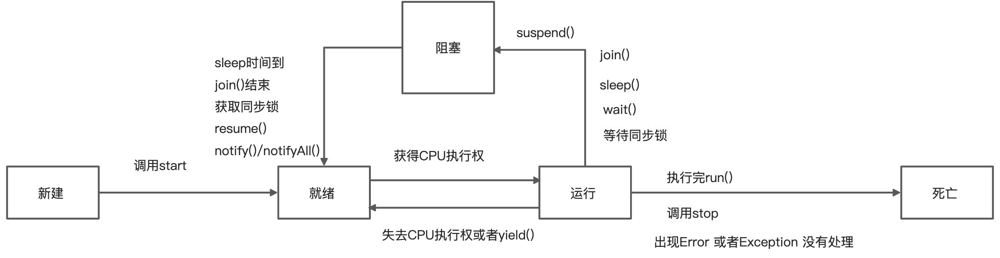

> 4种多线程的创建

> callable 接口没有阻塞

<a name="pIfMN"></a>

# 进程

是程序的一次执行过程 或者是一个**程序的执行**

> **程序相当于是静态代码 进程就是相当于运行的进程**

<a name="cpXRQ"></a>

# 线程

是一个程序的内部的执行路径 每个线程都有不同的内存区域

> 作为调度和执行的单位 每个线程拥有独立的运行栈和程序技术器
> 多线程为了提高CPU的利用率

一个main方法就相当于一个线程
一个线程执行一段时间后会将执行权返回给cpu 然后线程继续抢占调度 <a name="ewVnj"></a>

# 并行与并发

并行： 多个CPU同时执行多个任务
并发： 一个CPU(采用时间切片) 同时执行多个任务 比如：秒杀 多个人做同一件事情

<a name="xiy7n"></a>

# 线程的创建和使用

<a name="dsNbc"></a>

## 创建多线程的几种方式：

1. 继承Thread类（并且重写run方法）

```java
class MyThread extends Thread {
    // 重写run方法 线程需要操作的事情 写在run 方法中
    public void run() {
        for (int i = 1; i <= 100; i++) {
            if (i % 2 == 0) {
                System.out.println("i = " + i);
            }
        }
    }
}

public class ThreadDemo {
    public static void main(String[] args) {
        MyThread thread = new MyThread();
        thread.start();
        for (int i = 1; i < 100; i++) {
            if (i % 2 == 0) {
                System.out.println(i + "--------------");
            }
        }
    }
}

```

2. 实现Runnable 接口(开发中使用优先级更高（更适合用来实现处理多线程共享数据的情况）)

```java
class runn implements Runnable {

    @Override
    public void run() {
        for (int i = 0; i < 100; i++) {
            System.out.println("i = " + i);
        }
    }
}

public class runnable {
    public static void main(String[] args) {
        runn r = new runn();
        new Thread(r).start();
    }
}
```

3. 实现Callable（支持范型）接口（与使用Runnable接口相比 Callable功能更加强大一些）
4. 相比run方法 可以有返回值
5. 方法可以抛出异常
6. 支持范型的返回值
7. 需要借助FutureTask类 比如获取返回结果

<a name="hqfNb"></a>

## Future接口

> 可以对具体Runnable、Callable任务的执行结果进行取消 查询是否完成 获取结果等

**FutureTask 是Futrue接口的唯一实现类**

FutureTask同时实现了Runnable，Future接口 它既可以作为Runnable被线程执行 又可以作为Future得到Callable的返回值

```java
package main.com.xchen.javaDemo.Thead;

import java.util.concurrent.Callable;
import java.util.concurrent.ExecutionException;
import java.util.concurrent.FutureTask;

/**
 * @author: xchen
 * @createTime: 2022-01-28 00:02:22
 * @description: Callable 实现接口
 */

class Callables implements Callable {
    @Override
    public Object call() throws Exception {
        int num = 0;
        for (int i = 1; i <= 100; i++) {
            if (i % 2 == 0) {
                num += i;
            }
        }
        return num;
    }
}

public class callable {

    public static void main(String[] args) {
        Callables callables = new Callables();
        FutureTask futureTask = new FutureTask(callables);
        new Thread(futureTask).start();
        try {
            Object obj = futureTask.get();
            System.out.println("obj = " + obj);
        } catch (InterruptedException e) {
            e.printStackTrace();
        } catch (ExecutionException e) {
            e.printStackTrace();
        }
    }
}
```

4. 线程池的创建方式:

提前创建多个线程 放入线程池中 使用时直接获取 使用完放回池中 可以避免频繁创建销毁 实现重复利用
好处：

1. 提高响应速度（减少了创建新线程的时间）
2. 降低资源消耗(重复利用线程池中线程 不需要每次都创建)
   1. 便于线程管理 corePoolSize:线程池大小
   2. maximumPoolSize： 最大线程数
   3. keepAliveTime：线程没有任务时最多保持多长时间后会终止

**线程池相关的API：ExecutorService和Executors**
Executor Service： 真正的线程池接口 常见的子类有**ThreadPoolExecutor**

- void execute(Runnable command) : 执行任务/命令 没有返回值 一般用来执行Runnable

```java
package main.com.xchen.javaDemo.Thead;

import java.util.concurrent.Callable;
import java.util.concurrent.ExecutorService;
import java.util.concurrent.Executors;

/**
 * @author: xchen
 * @createTime: 2022-01-28 16:30:21
 * @description:
 */
class runnables implements Runnable {
    public void run() {
        for (int i = 1; i <= 100; i++) {
            if (i % 2 == 0) {
                System.out.println(Thread.currentThread().getName() + ":" + i);
            }
        }
    }
}

public class executorServices {
    // 线程池接口
    public static void main(String[] args) {
       //提供指定数量的线程池
        ExecutorService service = Executors.newFixedThreadPool(10);
      //执行指定线程的操作
        service.execute(new runnables()); //适合Runnable
        service.shutdown();
    }
}
```

- Futuresubmit(Callable task) : 执行任务 有返回值 一般用来执行Callable

```java
class callablesd implements Callable {

    @Override
    public Object call() throws Exception {

        for (int i = 1; i <= 100 ; i++) {
            if(i % 2 != 0) {
                System.out.println(Thread.currentThread().getName() + ":" + i);
            }
        }
        return null;
    }
}

public class executorServices {
    // 线程池接口
    public static void main(String[] args) {
        //提供指定数量的线程池
        ExecutorService service = Executors.newFixedThreadPool(10);
        service.submit(new callablesd()); //适合Callable 也可以用Runnable
      //关闭连接池
        service.shutdown();
    }
}
```

- void shutdown() : 关闭连接池

Executors: 工具类 线程池的工厂类 用于创建并且返回不同类型的线程池

1. Executors.newCachedThreadPool(): 创建一个可根据需要创建新线程的线程池
2. Executors.newFixedThreadPool() : 创建一个可以重复使用的固定线程数的线程池
3. Executors.newSingleThreadExecutor(): 创建一个只有一个线程的线程池
4. Executors.newScheduledThreadPool(n): 创建一个线程池 它可安排在给定延迟后运行命令或者定期的执行

<a name="8433a030"></a>

## 线程池的属性

```java
  ExecutorService service = Executors.newFixedThreadPool(10);
  ThreadPoolExecutor servicePool = (ThreadPoolExecutor)service;
  // ThreadPoolExecutor extends AbstractExecutorService implements ExecutorService
    servicePool.setCorePoolSize(10);
    servicePool.setMaximumPoolSize(8);
```

<a name="IGa6q"></a>

# 线程的异常

```java
public class ThreadDemo {
    public static void main(String[] args) {
        MyThread thread = new MyThread();
        thread.start();
        thread.start();
    }
}
```

抛出异常：

```java
Exception in thread "main" java.lang.IllegalThreadStateException
	at java.base/java.lang.Thread.start(Thread.java:794)
```

> 线程不可以二次start 否则会抛出 IllegalThreadStateException

```java
 if (threadStatus != 0)
            throw new IllegalThreadStateException();
```

<a name="Gw5P0"></a>

# 线程的常用方法

1. Thread.currentThread().getName()

```java
void start() : 启动线程 执行run方法
run() : 线程被调度时执行的操作
String getName() : 返回线程的名称
void setName(String name) : 设置线程名称
static Thread currentThread(): 返回当前线程 在Thread子类中就是this 通常用于主线程和Runnable实现类
static void yield(): 线程让步(释放当前cpu的执行)
 暂停当前正在执行的线程 把执行机会让给优先级相同或者更高的线程
 若队列中没有同优先级的线程 则会忽略此方法
join() : 当某个程序执行流中调用其他线程的join()方法时 调用线程将被阻塞 直到join()方法加入的join线程被执行为止(低优先级的线程也可以获得执行)
boolean isAlive() : 判断线程是否还活着
```

<a name="yT74p"></a>

# 线程调度（线程优先级）

线程的调度策略是 以时间切片的形式调度

> 抢占式： 高优先级的线程抢占CPU

同优先级线程组成先进先出队列(先到先服务) 使用时间切片策略
对于高优先级，使用优先调度的抢占式策略 <a name="qwcE8"></a>

## 优先级

- MAX\_PRIORITY:10 最大值
- MIN\_PRIORITY: 1 最小值
- NORM\_PRIORITY: 默认值

方法：
getPriority() 获取优先级
setPriority(int newPriority) 设置优先级

> 优先级只是抢占的概率更大 并不是高优先级执行完之后在执行低优先级

� <a name="uwmDo"></a>

# 线程的生命周期

```java
public enum State {
NEW //新建状态 
    RUNNABLE //就绪状态
    BLOCKED //运行状态
    WAITING 
    TIMED_WAITING
    TERMINATED
}
```

1. 新建：(NEW)当一个Thread类或者其子类对象被声明创建的时候，新生的线程对象处于新建状态
2. 就绪：(start()方法调用) 处于新建状态下的被start（）后 将进入线程队列等待CPU时间片 此时它具备了运行的条件 只是没分配到CPU资源
3. 运行：就绪的线程被调度分配到了CPU资源时 就进入了运行状态 run（）方法定义了线程的操作和功能
4. 阻塞：被认为挂起或者执行输入输出操作时，让CPU并临时终止自己的执行 进入阻塞状态
5. 死亡 线程完成全部的工作 或线程被提前强制性地终止或出现异常导致结束

 <a name="m2a4o"></a>

# 线程安全问题

**多线程共享数据 会造成操作的不完整性**

<a name="VBl8O"></a>

# 解决线程安全问题：

1. 同步代码块：

```java
	synchronized(同步监视器){
        // 需要被同步的代码 (操作共享数据的代码 才是需要被同步的代码)
    }
```

**共享数据：多个线程共同操作的数据**

```java
    final Object object = new Object();    
	public void run() {
        while (true) {
            // 有时也会用this代替object（需要保证唯一）
            synchronized (object) {
                if (ticket > 0) {
                    System.out.println(ticket); 
                    ticket--;
                } else {
                    break;
                }
            }
        }
    }
```

> 操作同步代码时 只能有一个线程参与 其他线程等待 相当于是一个单线程的过程 此时的效率低

2. 同步方法：

> 同步方法仍涉及同步监视器 只是不需要显示声明
> 非静态的同步代码 同步监视器是：this
> 静态的同步方法 同步监视器是： 当前类本身

如果操作共享数据的代码**完整的**声明在一个方法中 我们不妨碍将此方法声明为同步的

```java
    // 同步方法
    public synchronized void runs(){ // 之类的同步监视器就是this
        // ...operations
    }

```

类继承同步方法使用：

```java
    public static synchronized void runss(){}
```

<a name="dnEFn"></a>

## 分析同步原理

>

<a name="dEKdR"></a>

## 同步监视器

俗称：锁 任何一个类的对象（或者类 **类也是对象 demo.class**）都可以充当锁 但是多线程需要共同公用同一把锁

<a name="w1HG0"></a>

# 死锁

不同的线程分别占用对方需要的同步资源不放弃 都在等待对方放弃自己需要的同步资源 造成了线程的死锁

出现死锁后 不会出现异常 不会出现提示 只是所有的线程都处于阻塞状态 无法继续

> 尽量减少同步资源的定义
> 尽量避免嵌套同步

```java
package main.com.xchen.javaDemo.Thead;

/**
 * @author: xchen
 * @createTime: 2022-01-27 00:25:52
 * @description:
 */
public class deadSuo {
    //死锁问题
    static final StringBuffer s1 = new StringBuffer();
    static final StringBuffer s2 = new StringBuffer();
    // 第一个线程
    static  class S1Thread extends Thread {
        public void run() {
            synchronized (s1) {
                s1.append("s1 a");
                s2.append("s2 a");
                // 添加一个线程睡眠 为了更好的显示线程死锁的问题
                try {
                    Thread.sleep(100);
                } catch (InterruptedException e) {
                    e.printStackTrace();
                }
                synchronized (s2) {
                    s1.append("s1 b");
                    s2.append("s2 b");
                    System.out.println(s1);
                    System.out.println(s2);
                }
            }
        }
    }
    static class S2Thread implements Runnable {
        public void run() {
            synchronized (s2) {
                s1.append("s1 c");
                s2.append("s2 c");
                synchronized (s1) {
                    s1.append("s1 d");
                    s2.append("s2 d");
                    System.out.println(s1);
                    System.out.println(s2);
                }
            }
        }
    }

    public static void main(String[] args) {
        new S1Thread().start();
        new Thread(new S2Thread()).start();
    }
}

```

<a name="3af6a983"></a>

# Lock锁

JDK5.0开始 java提供了更强大的线程同步机制---通过显示定义同步锁对象来实现同步 同步锁使用了Lock锁对象充当

> Java.util.concurrent.locks.Lock 接口是控制多个线程对共享资源进行访问的工具。

ReentrantLock类实现了Lock 它拥有与synchronized相同的并发性和内存语义 在实现线程安全的控制中 比较常用的是ReentrantLock 可以显式加锁 释放锁

```java
package main.com.xchen.javaDemo.Thead;

import java.util.concurrent.locks.ReentrantLock;

/**
 * @author: xchen
 * @createTime: 2022-01-27 14:34:58
 * @description:
 */
public class lock extends Thread {
    private static int ticker = 100;
    // 这个锁也是要多线程使用共一个锁
    // 构造参数 fair:true 表示的是一种先进先出的状态 不再是线程抢占的情况 如果没有值 则是线程抢占的情况
    private final static ReentrantLock r = new ReentrantLock(true);
    public void run() {
     //  卖票
        while(true) {
            // 调用锁定的方法lock();
            try{
                r.lock();
                try {
                    Thread.sleep(100);
                } catch (InterruptedException e) {
                    e.printStackTrace();
                }
                if(ticker > 0) {
                    System.out.println(getName() + ":"+ ticker);
                    ticker--;
                }else break;
            }finally {
                r.unlock();
            }
        }
    }
    public static void main(String[] args) {
            lock l1  = new lock();
            lock l2 = new lock();
            lock l3 = new lock();
            l1.start();
            l2.start();
            l3.start();
    }
}
```

<a name="6cf4280c"></a>

## synchronized和lock的异同

    相同：都可以解决线程安全问题

    不同：synchroinzed机制在执行完相应的同步代码以后 自动释放同步监视器。lock 需要手动的启动同步（lock()） 同时结束同步也需要手动的实现(unlock())

> 优先使用顺序 : lock（优先） => 同步代码块 => 同步方法

<a name="8590809f"></a>

# 线程通信的三个方法

wait(); 执行此方法 当前线程就会进入阻塞状态 并且释放同步监视器（注意这个方法要卸载synchronized 里面）

notify(); 执行会唤醒一个被wait的一个线程 若果有多个线程被wait 就唤醒优先级高的wait

notifyAll(); 会唤醒所有被wait()的线程

> IllegalMonitorStateException 如果没有在synchronize(同步代码块或者同步方法)里面 则会抛出这个异常

> 这三个方法的调用者必须是同步代码块或者同步方法中的同步监视器（wait notify ontifyAll 在object.java中）

```java
package main.com.xchen.javaDemo.Thead;

/**
 * @author: xchen
 * @createTime: 2022-01-27 19:24:26
 * @description:
 */
class communication implements Runnable {
    public int number = 100;

    @Override
    public void run() {
        while (true) {
            synchronized (this) {
                notify();
                if (number > 0) {
                    number--;
                    System.out.println(Thread.currentThread().getName() + ":" + number);
                    try {
                        wait();
                    } catch (InterruptedException e) {
                        e.printStackTrace();
                    }
                } else
                    break;
            }
        }
    }
}

public class communicationThread {
    //线程通信
    public static void main(String[] args) {
        communication com = new communication();
        new Thread(com).start();
        new Thread(com).start();
    }
}
```

<a name="kub24"></a>

# 生产者/消费者 例题

```java
package main.com.xchen.javaDemo.Thead;

/**
 * @author: xchen
 * @createTime: 2022-01-27 20:44:15
 * @description: 生产者 消费者
 */

public class Cleck {
    private static int product = 0; //商品

    public static int getProduct() {
        return product;
    }

    public static void setProduct(int product) {
        Cleck.product = product;
    }

    class Clecks {
        // 生产产品
        public void produceProduct() {
            synchronized (Cleck.class) {
                if (getProduct() < 20) {
                    setProduct(getProduct() + 1);
                    System.out.println(Thread.currentThread().getName() + "正在生产第：" + getProduct() + "产品");
                    // 每生产一个产品 都可以让消费者消费
                    Cleck.class.notify();
                } else {
                    // 等待消费者消费
                    try {
                        Cleck.class.wait();
                    } catch (InterruptedException e) {
                        e.printStackTrace();
                    }
                }
            }
        }

        //消费产品
        public void consumerProduct() {
            synchronized (Cleck.class) {
                if (getProduct() > 0) {
                    System.out.println(Thread.currentThread().getName() + "正在消费第" + getProduct() + "产品");
                    setProduct(getProduct() - 1);
                    // 每消费一个产品都可以让生产者继续生产
                    Cleck.class.notify();
                } else {
                    // 等待 生产者 生产
                    try {
                        Cleck.class.wait();
                    } catch (InterruptedException e) {
                        e.printStackTrace();
                    }
                }
            }

        }
    }

    class producter implements Runnable {
        private Clecks clecks = new Clecks();

        public void run() {
            System.out.println("正在生产产品");
            while (true) {
                try {
                    Thread.sleep((int) (Math.random() * 500));
                } catch (InterruptedException e) {
                    e.printStackTrace();
                }
                clecks.produceProduct();
            }
        }
    }

    class consumer implements Runnable {
        private Clecks clecks = new Clecks();

        public void run() {
            System.out.println("正在消费产品");
            while (true) {
                try {
                    Thread.sleep((int) (Math.random() * 500));
                } catch (InterruptedException e) {
                    e.printStackTrace();
                }
                clecks.consumerProduct();
            }
        }
    }

    public static void main(String[] args) {
        Cleck cleck = new Cleck();
        new Thread(cleck.new consumer()).start();
        new Thread(cleck.new producter()).start();

    }
}

```
