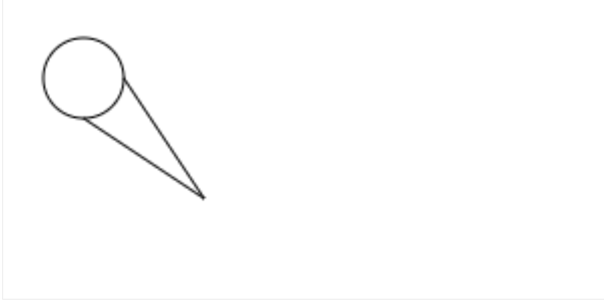
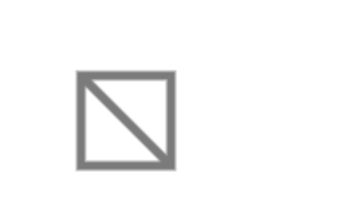
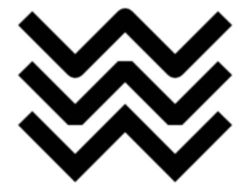
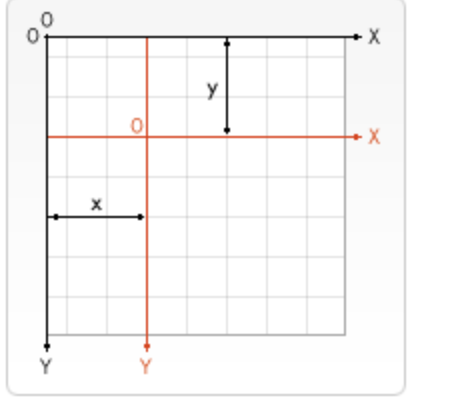
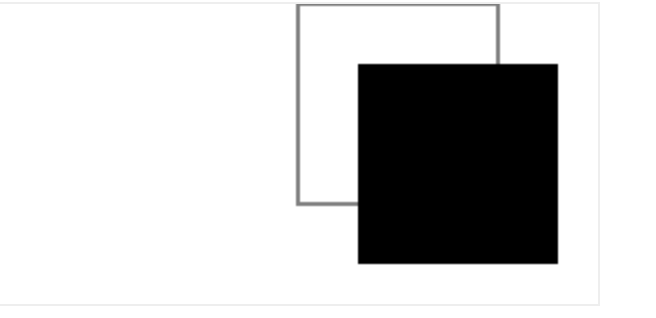
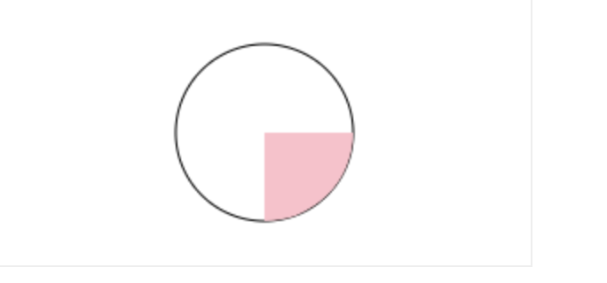

# canvas设置宽高

> 不给 <canvas> 设置 widht、height 属性时，则默认 width为300、height 为 150，单位都是 px。也可以使用 css 属性来设置宽高，但是如宽高属性和初始比例不一致，他会出现扭曲。

1. canvas不仅要在style中设置宽高 也要在这个dom元素上设置宽高才有效

```typescript
const canvas = canvasRef.current as unknown as HTMLCanvasElement;
canvas.width = 700;
canvas.height = 300;
```

canvas 如果没有指定width和height 则默认是300 * 150的布局

```html
<canvas ref={canvasRef as React.RefObject<HTMLCanvasElement>}>您的浏览器不支持canvas 请先升级浏览器</canvas>
```

**canvas元素默认被网格所覆盖。通常来说网格中的一个单元相当于 canvas 元素中的一像素。栅格的起点为左上角，坐标为 (0,0) 。所有元素的位置都相对于原点来定位。所以图中蓝色方形左上角的坐标为距离左边（X 轴）x 像素，距离上边（Y 轴）y 像素，**

# getImageData和putImageData

> 注意imgData可能会为undefined

```typescript
imgData = ctx.getImageData(0, 0, canvas.clientWidth, canvas.clientWidth);
----------------------------------------------
  ctx.putImageData(imgData, 0, 0);
```


# 绘制矩形

```typescript
function draw<T extends HTMLCanvasElement>(canvas: T): void {
  if (!canvas.getContext) return;
  // 获取2d的渲染上下文对象
  const ctx: CanvasRenderingContext2D | null = canvas.getContext('2d');
  if (ctx !== null) {
    // 指定闭合图形的颜色值
    ctx.fillStyle = 'rgb(200,0,0)';
    // 指定绘制矩形的位置以及宽高
    ctx.fillRect(10, 10, 55, 55);

    ctx.fillStyle = 'rgba(0, 0, 0,.3)';

    ctx.fillRect(25, 25, 100, 100);
  }
}
```

```html
<canvas
 ref={canvasRef as React.RefObject<HTMLCanvasElement>}
	>
	您的浏览器不支持canvas 请先升级浏览器
</canvas>

```

canvast 提供了三种方法绘制矩形：

> **x, y**：指的是矩形的距离左上角的坐标。(相对于canvas的坐标原点)

- 1、**fillRect(x, y, width, height)**：绘制一个填充的矩形。（默认颜色为黑色）
- 2、**strokeRect(x, y, width, height)**：绘制一个矩形的边框。(默认也为黑底)
- 3、**clearRect(x, y, widh, height)**：清除指定的矩形区域，然后这块区域会变的完全透明。

> html接上述

```typescript
 		ctx.fillStyle = 'rgb(200,0,0)';
    // 指定绘制矩形的位置以及宽高
    ctx.fillRect(10, 10, 55, 55);

    ctx.fillStyle = 'rgba(0, 0, 0,.3)';

    ctx.fillRect(70, 10, 55, 55);

    // 绘制一个矩形的边框
    ctx.strokeRect(70, 75, 55, 55);

    ctx.strokeRect(10, 75, 55, 55);

    //将矩形填充的中间部分隐藏
    ctx.clearRect(25, 25, 25, 25);

    ctx.clearRect(85, 25, 25, 25);
```


# 绘制路径

图形的基本元素是路径
路径是通过不同颜色和宽度的线段或曲线相连形成的不同形状的点的集合。
一个路径，甚至一个子路径，都是闭合的。

```typescript
function drawPath<T extends HTMLCanvasElement>(canvas: T): void {
  if (!canvas.getContext) return;
  const ctx = canvas.getContext('2d');
  if (ctx !== null) {
    /**
     * @method: beginPath()
     * @param: 新建一条路径，路径一旦创建成功，图形绘制命令被指向到路径上生成路径
     */
    ctx.beginPath();
    /**
     * @method: moveTo(x,y)
     * @param: 把画笔移动到指定的坐标(x, y)。相当于设置路径的起始点坐标。这个一定需要设置 不能直接lineTo
     */
    ctx.moveTo(100, 100);
    /**
     * @method: lineTo(x,y)
     * @param: 绘制一条从当前位置到指定坐标(x, y)的直线.
     */
    ctx.lineTo(200, 50);

    ctx.lineTo(180, 85);

    ctx.lineTo(100, 100);

    ctx.lineTo(220, 96);

    ctx.lineTo(180, 85);
    /**
     * @method: closePath()
     * @param：闭合路径之后，图形绘制命令又重新指向到上下文中
     * 这个相当于最后一个点和第一个点做一次lineTo
     */
    // ctx.closePath();
    /**
     * @method: stroke()
     * @param：通过线条来绘制图形轮廓
     */
    ctx.stroke(); //绘制路径。
    // ctx.closePath();
    // 填充闭合区域。如果path没有闭合，则fill()会自动闭合路径。
    // （如果没有closePath 会自动closePath）
    // fill()
  }
}
```


# 绘制圆弧

1. **arc(x, y, r, startAngle, endAngle, anticlockwise)**: 以(x, y) 为圆心，以r 为半径，从 startAngle 弧度开始到endAngle弧度结束。anticlosewise 是布尔值，true 表示逆时针，false 表示顺时针(默认是顺时针)。

   弧度计算:

```typescript
radians = (Math.PI / 180) * degrees; //角度转换成弧度
```

```typescript
if (!canvas.getContext) return;
  const ctx = canvas.getContext('2d');
  if (ctx !== null) {
    ctx.beginPath();
    ctx.moveTo(100, 100);
    ctx.lineTo(40, 60);
    ctx.stroke();
    ctx.closePath();
    //画圆
    ctx.beginPath();
    /**
     * @method: arc(x,y,radius,startAngle,endAngle,counterClockWise)
     */
    ctx.arc(40, 40, 20, 0, Math.PI * 2, false);
    ctx.lineTo(100, 100);
    ctx.stroke();
  }
```



2. **arcTo(x1, y1, x2, y2, radius)**: 根据给定的控制点和半径画一段圆弧，最后再以直线连接两个控制点。

```typescript
if (!canvas.getContext) return;
  const ctx = canvas.getContext('2d');
  if (ctx !== null) {
    ctx.beginPath();
    /**
     * @method: arcTo() 这个方法可以这样理解。绘制的弧形是由两条切线所决定
     * @param: 参数1、2：控制点1坐标   参数3、4：控制点2坐标  参数4：圆弧半径 moveTo()改变起始点
     * @param: 第 1 条切线：起始点和控制点1决定的直线。
     * @param: 第 2 条切线：控制点1 和控制点2决定的直线。
     * @param: radius是相对于第一个控制点的坐标来的
     * @param: 起始点会连接一条线 这条线相聚小于radius时 开始由第一条切线画圆弧到第二条切线 且停止位置时								相对与控制点1的坐标的连线的等于radius
     */
    ctx.moveTo(0, 0);
    ctx.arcTo(100, 0, 100, 100, 100);
    ctx.stroke();

    ctx.beginPath();
    ctx.rect(0, 0, 5, 5);
    ctx.rect(100, 0, 10, 10);
    ctx.rect(100, 100, 5, 5);
    ctx.fill();
  }
```


# 绘制贝塞尔曲线

**二次贝塞尔曲线**

```typescript
/**
 * 二次贝塞尔曲线
 */
import * as React from 'react';
import bezierLess from './bezier2.module.less';
import { ChangeEvent } from 'react';
interface props {}
const canvas: React.RefObject<HTMLCanvasElement> = React.createRef();
const { useEffect, useState } = React;
function bezier<T extends HTMLCanvasElement | null>(
  canvas: T,
  cp1x: number,
  cp1y: number
): void {
  if (canvas === null || !canvas.getContext) return;
  const ctx: CanvasRenderingContext2D | null = canvas.getContext('2d');
  if (ctx !== null) {
    //开始绘制
    ctx.clearRect(0, 0, 300, 150);
    ctx.beginPath();
    ctx.moveTo(0, 150);
    ctx.quadraticCurveTo(cp1x, cp1y, 300, 0);
    ctx.stroke();
    ctx.beginPath();
    ctx.rect(cp1x, cp1y, 2, 2);
    ctx.rect(0, 147, 2, 2); //起始点
    ctx.rect(300, 0, 2, 2); //终点
    ctx.stroke();
  }
}
function draw<T extends HTMLCanvasElement | null>(
  canvas: T,
  foo: number,
  bar: number
) {
  bezier(canvas, foo, bar);
}

const Bezier2: React.FC<props> = function () {
  const [x, UseSizeX] = useState(0);
  const [y, UseSizeY] = useState(0);
  function changeSize<T extends ChangeEvent>(e: T, str: string): void {
    if (e && e.target) {
      if (str === 'x') {
        UseSizeX(() => {
          return Number.parseInt((e.target as HTMLInputElement).value || '0');
        });
      } else {
        UseSizeY(() => {
          return Number.parseInt((e.target as HTMLInputElement).value || '0');
        });
      }
    }
  }
  function drawBezier(): void {
    draw<HTMLCanvasElement | null>(canvas.current, x, y);
  }
  useEffect(() => {
    const ctx: HTMLCanvasElement | null = canvas.current;
    draw(ctx, 0, 0);
  }, []);
  return (
    <div>
      <canvas
        ref={canvas}
        style={{ width: '600px', height: '300px', border: '1px solid #eee' }}
      />

      <div className={bezierLess['bezier2']}>
        <div> 控制点</div>
        <div>
          x:
          <input
            type="text"
            value={x}
            onChange={(e) => changeSize<ChangeEvent<HTMLInputElement>>(e, 'x')}
          />
          y:
          <input
            type="text"
            value={y}
            onChange={(e) => changeSize<ChangeEvent<HTMLInputElement>>(e, 'y')}
          />
        </div>
      </div>
      <div>
        <button onClick={drawBezier}>点击绘制二次贝塞尔曲线</button>
      </div>
    </div>
  );
};
export default Bezier2;
```

**三次贝塞尔曲线**

```typescript
/**
 * @author xchen
 * @title 三次贝塞尔曲线
 */
import * as React from 'react';
import bezierLess from './bezier2.module.less';
import { ChangeEvent } from 'react';
interface props {}

interface stateCollection<T> {
  [key: string]: React.Dispatch<React.SetStateAction<T>>;
}
const canvas: React.RefObject<HTMLCanvasElement> = React.createRef();
const { useEffect, useState } = React;
function bezier<T extends HTMLCanvasElement | null>(
  canvas: T,
  cp1x: number,
  cp1y: number,
  cp2x: number,
  cp2y: number
): void {
  if (canvas === null || !canvas.getContext) return;
  const ctx: CanvasRenderingContext2D | null = canvas.getContext('2d');
  if (ctx !== null) {
    //开始绘制
    ctx.clearRect(0, 0, 300, 150);
    ctx.beginPath();
    ctx.moveTo(0, 150);
    ctx.bezierCurveTo(cp1x, cp1y, cp2x, cp2y, 300, 150);
    ctx.stroke();
    ctx.beginPath();
    ctx.rect(cp1x, cp1y, 2, 2);
    ctx.rect(cp2x, cp2y, 2, 2);
    ctx.rect(0, 147, 2, 2); //起始点
    ctx.rect(298, 148, 2, 2); //终点
    ctx.stroke();
  }
}

const Bezier3: React.FC<props> = function () {
  const [x1, UseSizeX1] = useState(20);
  const [x2, UseSizeX2] = useState(280);
  const [y1, UseSizeY1] = useState(20);
  const [y2, UseSizeY2] = useState(70);

  function changeSize<T extends ChangeEvent>(e: T, str: string): void {
    if (e && e.target) {
      const map: stateCollection<number> = {
        x1: UseSizeX1,
        y1: UseSizeY1,
        x2: UseSizeX2,
        y2: UseSizeY2
      };
      map[str](() => {
        return Number.parseInt((e.target as HTMLInputElement).value || '0');
      });
    }
  }

  function draw<T extends HTMLCanvasElement | null>(
    canvas: T,
    cp1x: number,
    cp1y: number,
    cp2x: number,
    cp2y: number
  ) {
    bezier(canvas, cp1x, cp1y, cp2x, cp2y);
  }
  function drawBezier(): void {
    draw<HTMLCanvasElement | null>(canvas.current, x1, y1, x2, y2);
  }
  // eslint-disable-next-line
  useEffect(drawBezier, []);
  return (
    <div>
      <canvas
        ref={canvas}
        style={{ width: '600px', height: '300px', border: '1px solid #eee' }}
      />

      <div className={bezierLess['bezier2']}>
        <div> 控制点</div>
        <div>
          x1:
          <input
            type="text"
            value={x1}
            onChange={(e) => changeSize<ChangeEvent<HTMLInputElement>>(e, 'x1')}
          />
          y1:
          <input
            type="text"
            value={y1}
            onChange={(e) => changeSize<ChangeEvent<HTMLInputElement>>(e, 'y1')}
          />
        </div>
        <div>
          x2:
          <input
            type="text"
            value={x2}
            onChange={(e) => changeSize<ChangeEvent<HTMLInputElement>>(e, 'x2')}
          />
          y2:
          <input
            type="text"
            value={y2}
            onChange={(e) => changeSize<ChangeEvent<HTMLInputElement>>(e, 'y2')}
          />
        </div>
      </div>
      <div>
        <button onClick={drawBezier}>点击绘制三次贝塞尔曲线</button>
      </div>
    </div>
  );
};
export default Bezier3;
```


# 设置样式

设置样式有两个属性：

1. fillStyle = color 设置图形的填充颜色
2. strokeStyle = color 设置图形轮廓的颜色

> 一旦您设置了 strokeStyle 或者 fillStyle 的值，那么这个新值就会成为新绘制的图形的默认值。如果你要给每个图形上不同的颜色，你需要重新设置 fillStyle 或 strokeStyle 的值

```typescript
function style<T extends HTMLCanvasElement>(canvas: T): void {
  if (!canvas.getContext) return;
  const ctx = canvas.getContext('2d');
  if (ctx !== null) {
    ctx.beginPath();
    /**
     * @method: fillStyle
     * @param: fillStyle(color) 设置图形的填充颜色
     */
    ctx.fillStyle = 'rgb(125,25,29)';
    ctx.strokeStyle = 'rgb(123,123,123)';
    ctx.rect(20, 20, 30, 30);
    /**
     * @method: strokeStyle边框颜色
     * @method: strokeRect 填充边框
     */
    ctx.strokeRect(20, 20, 30, 30);
    ctx.globalAlpha = 0.7;
    ctx.fill();
  }
```

**globalAlpha 这个属性影响到 canvas 里所有图形的透明度，有效的值范围是 0.0 （完全透明）到 1.0（完全不透明），默认是 1.0。(用rgba代替)**

# 线宽度

> 起始点和终点的连线为中心，**上下各占线宽的一半**。

lineWidth： 不仅会影响lineTo描绘的线宽 也会影响strokeRect的宽度

```typescript
function lineStyle<T extends HTMLCanvasElement>(canvas: T): void {
  if (!canvas.getContext) return;
  const ctx = canvas.getContext('2d');
  if (ctx !== null) {
    ctx.beginPath();
    ctx.lineWidth = 5;
    ctx.moveTo(50, 50);
    ctx.lineTo(100, 100);
    ctx.strokeStyle = 'rgb(123,123,123)';
    ctx.strokeRect(50, 50, 50, 50);
    ctx.stroke();
    ctx.closePath();
  }
}
```



# lineCap 线条末端样式

**lineCap = type**

1. butt：线段末端以方形结束
2. round：线段末端以圆形结束
3. square：线段末端以方形结束，但是增加了一个宽度和线段相同，高度是线段厚度一半的矩形区域。(lineTo)

**lineJoin = type**
同一个 path 内，设定线条与线条间接合处的样式。
共有 3 个值 round, bevel 和 miter：

1. round 通过填充一个额外的，圆心在相连部分末端的扇形，绘制拐角的形状。 圆角的半径是线段的宽度。
2. bevel 在相连部分的末端填充一个额外的以三角形为底的区域， 每个部分都有各自独立的矩形拐角。
3. miter(默认) 通过延伸相连部分的外边缘，使其相交于一点，形成一个额外的菱形区域。



# 虚线

```typescript
function lineDash<T extends HTMLCanvasElement>(canvas: T): void {
  if (!canvas.getContext) return;
  const ctx = canvas.getContext('2d');
  if (ctx !== null) {
    ctx.beginPath();
    ctx.setLineDash([20, 5]); //[实现宽度, 虚线宽度]
    // lineDashOffset属性设置起始偏移量
    ctx.lineDashOffset = 10; //正数顺时针 负数逆时针
    ctx.rect(20, 20, 50, 50);
    //绘制轮廓
    ctx.stroke();
    ctx.closePath();
  }
}
```


# 绘制文本

1. fillText(text, x, y \[, maxWidth]) 在指定的 (x,y) 位置填充指定的文本，绘制的最大宽度是可选的。
2. strokeText(text, x, y \[, maxWidth]) 在指定的 (x,y) 位置绘制文本边框，绘制的最大宽度是可选的。

```typescript
function fillText<T extends HTMLCanvasElement>(canvas: T): void {
  if (!canvas.getContext) return;
  const ctx = canvas.getContext('2d');
  if (ctx !== null) {
    ctx.font = '50px sans-serif';
    ctx.fillText('xchen', 10, 50, 150);
    ctx.strokeText('xchen', 10, 100, 150);
  }
}
```


### 给文本添加样式

1. font = value 当前我们用来绘制文本的样式。这个字符串使用和 CSS font 属性相同的语法。 默认的字体是 10px sans-serif。
2. textAlign = value 文本对齐选项。 可选的值包括：start, end, left, right or center。 默认值是 start。
3. textBaseline = value 基线对齐选项，可选的值包括：top, hanging, middle, alphabetic, ideographic, bottom。默认值是 alphabetic。。
4. direction = value 文本方向。可能的值包括：ltr, rtl, inherit。默认值是 inherit。

# 绘制图片

> 如果 drawImage 的时候图片还没有完全加载完成，则什么都不做，个别浏览器会抛异常。所以我们应该保证在 img 绘制完成之后再 drawImage。

```typescript
function canvasImg<T extends HTMLCanvasElement>(canvas: T): void {
  if (!canvas.getContext) return;
  const ctx = canvas.getContext('2d');
  if (ctx !== null) {
    const img: HTMLImageElement = new Image();
    img.src = BgImage;
    img.onload = function () {
      /**
       * 缩放图片
       * drawImage(image, x, y, width, height)
       */
      ctx.drawImage(img, 0, 0, 300, 150);
    };
  }
}
```

> 使用webpack5 加载图片不再是url-loader file-loader row-loader等了 而是内置了asset模块
> @see https://webpack.docschina.org/guides/asset-modules/


## 切片(slice)

> drawImage(image, sx, sy, sWidth, sHeight, dx, dy, dWidth, dHeight)


# 保存和恢复

save and restore state
有两个属性save(） 和 restore(）
save 和 restore都是用来保存和恢复canvas状态的 都是没有参数的
Canvas 的状态就是当前画面应用的所有样式和变形的一个快照。
**1 . 关于 save() ：Canvas状态存储在栈中，每当save()方法被调用后，当前的状态就被推送到栈中保存。**
一个绘画状态包括：

- 当前应用的变形（即移动，旋转和缩放）
- strokeStyle, fillStyle, globalAlpha, lineWidth, lineCap, lineJoin, miterLimit, shadowOffsetX, shadowOffsetY, shadowBlur, shadowColor, globalCompositeOperation 的值
- 当前的裁切路径（clipping path）可以调用任意多次 save方法(类似数组的 push())。

**可以调用任意多次 save方法**(类似数组的push())。

2. **关于restore()：每一次调用 restore 方法，上一个保存的状态就从栈中弹出，所有设定都恢复(类似数组的 pop())。**

```typescript
function saveAndRestore<T extends HTMLCanvasElement>(canvas: T): void {
  if (!canvas.getContext) return;
  const ctx = canvas.getContext('2d');
  if (ctx !== null) {
    ctx.fillRect(0, 0, 150, 150); // 使用默认设置绘制一个矩形
    ctx.save(); // 保存默认状态
    ctx.fillStyle = 'red'; // 在原有配置基础上对颜色做改变
    ctx.fillRect(15, 15, 120, 120); // 使用新的设置绘制一个矩形

    ctx.save(); // 保存当前状态
    ctx.fillStyle = '#FFF'; // 再次改变颜色配置
    ctx.fillRect(30, 30, 90, 90); // 使用新的配置绘制一个矩形

    ctx.restore(); // 重新加载之前的颜色状态
    ctx.fillRect(45, 45, 60, 60); // 使用上一次的配置绘制一个矩形

    ctx.restore(); // 加载默认颜色配置
    ctx.fillRect(60, 60, 30, 30); // 使用加载的配置绘制一个矩形
  }
}
```


# 变形

> translate(x, y)

translate 方法接受两个参数。x 是左右偏移量，y 是上下偏移量
translate 移动的是 canvas 的坐标原点(坐标变换)。


```typescript
   	ctx.save(); //保存坐原点平移之前的状态
    ctx.translate(150, 0);
    ctx.strokeRect(0, 0, 100, 100);
    ctx.restore(); //恢复到最初状态
    ctx.translate(180, 30);
    ctx.fillRect(0, 0, 100, 100);
```


## rotate

> rotate(angle) 顺时针方向的，以弧度为单位的值

```typescript
ctx.rotate((Math.PI / 180) * 45);
```


## scale

> scale(x , y)  用它来增减图形在 canvas 中的像素数目，对形状，位图进行缩小或者放大。 值比 1.0 小表示缩 小，比 1.0 大则表示放大，值为 1.0 时什么效果都没有。

```typescript
 ctx.scale(1.5, 0.8);
```


## transform (变形矩阵)

> transform(a, b, c, d, e, f)
>
> - a (m11): Horizontal scaling.
> - b (m12): Horizontal skewing.
> - c (m21): Vertical skewing.
> - d (m22): Vertical scaling.
> - e (dx): Horizontal moving.
> - f (dy): Vertical moving.


# globalCompositeOperation 合成

> globalCompositeOperation = type
> type的取值:
>
> 1. source-in 仅仅会出现新图像与原来图像重叠的部分，其他区域都变成透明的。(包括其他的老图像区域也会透明)
> 2. source-out 仅仅显示新图像与老图像没有重叠的部分，其余部分全部透明。(老图像也不显示)
> 3. source-atop 新图像仅仅显示与老图像重叠区域。老图像仍然可以显示（**可以用来做画笔等功能**）
> 4. destination-over 新图像会在老图像的下面。
> 5. destination-in 仅仅新老图像重叠部分的老图像被显示，其他区域全部透明
> 6. destination-out 仅仅老图像与新图像没有重叠的部分。 注意显示的是老图像的部分区域（**刮刮卡的实现**）
> 7. destination-atop 老图像仅仅仅仅显示重叠部分，新图像会显示在老图像的下面（**可以制作悬浮点**）
> 8. lighter 新老图像都显示，但是重叠区域的颜色做加处理。
> 9. darken 保留重叠部分最黑的像素。(每个颜色位进行比较，得到最小的)

```typescript
blue: #0000ff
red: #ff0000
// 所以重叠部分的颜色：#000000。
```

> 10. lighten  保证重叠部分最量的像素。(每个颜色位进行比较，得到最大的)

```typescript
blue: #0000ff
red: #ff0000;
所以重叠部分的颜色：#ff00ff。
```

> 11.xor  重叠部分会变成透明。
> 12\. copy 只有新图像会被保留，其余的全部被清除(边透明)。


## 裁剪路径

clip()

> clip() 只能遮罩在这个方法调用之后绘制的图像，如果是 clip() 方法调用之前绘制的图像，则无法实现遮罩。

```typescript
function clip<T extends HTMLCanvasElement>(canvas: T): void {
  if (!canvas.getContext) return;
  const ctx = canvas.getContext('2d');
  if (ctx !== null) {
    ctx.beginPath();
    ctx.arc(150, 75, 50, 0, Math.PI * 2);
    ctx.stroke();
    ctx.clip();
    ctx.fillStyle = 'pink';

    ctx.fillRect(150, 75, 50, 50);
    ctx.strokeRect(150, 75, 50, 50);
  }
}
```



# demo1 太阳系

```typescript
/**
 * @author xchen
 * @param 太阳系绘画
 */

import * as React from 'react';
import { useEffect } from 'react';

interface props {}

interface Interface {
  radius: number;
  draw: (canvas: CanvasRenderingContext2D, x?: number, y?: number) => void;
}

const canvasRef = React.createRef();

interface SystemParam {
  width: number;
  height: number;
  sunRadius: number;
  earthRadius: number;
  trakRadius: number;
  earthTarkRadius: number;
  moonRadius: number;
}

// 系统画布的数据配置
const system: SystemParam = {
  width: 300,
  height: 150,
  sunRadius: 20, //太阳半径
  earthRadius: 10, //地球半径
  trakRadius: 50, //太阳轨道半径
  earthTarkRadius: 25, // 地球轨道半径
  moonRadius: 8
};

// 太阳
class sun implements Interface {
  radius: number;

  constructor(radius: number) {
    this.radius = radius;
  }

  public draw<T extends CanvasRenderingContext2D>(canvas: T): void {
    canvas.beginPath();
    canvas.arc(
      system.width / 2,
      system.height / 2,
      this.radius,
      Math.PI * 2,
      0
    );

    canvas.fillStyle = 'rgb(241,169,48)';
    canvas.fill();
    canvas.closePath();
  }
}

/**
 * 地球
 */
class earth implements Interface {
  draw(canvas: CanvasRenderingContext2D): void {
    canvas.beginPath();
    const time = new Date();
    canvas.rotate(
      // getSeconds 秒速
      ((2 * Math.PI) / 60) * time.getSeconds() +
        ((2 * Math.PI) / 60000) * time.getMilliseconds()
    );

    canvas.fillStyle = 'rgb(18,23,166)';
    canvas.arc(50, 0, 10, Math.PI * 2, 0, false);

    canvas.fill();
    canvas.closePath();
  }

  radius: number;

  constructor(radius: number) {
    this.radius = radius;
  }
}

/**
 * @class 轨道
 */
class track implements Interface {
  radius: number;

  constructor(radius: number) {
    this.radius = radius;
  }

  draw(canvas: CanvasRenderingContext2D, x?: number, y?: number): void {
    canvas.beginPath();
    canvas.arc(
      typeof x === 'number' ? x : system.width / 2,
      typeof y === 'number' ? y : system.height / 2,
      this.radius,
      Math.PI * 2,
      0
    );
    canvas.fillStyle = 'rgb(131,120,118)';
    canvas.stroke();
    canvas.closePath();
  }
}

class moon implements Interface {
  draw(
    canvas: CanvasRenderingContext2D,
    x: number | undefined,
    y: number | undefined
  ): void {
    canvas.beginPath();

    const date = new Date();
    canvas.rotate(
      ((2 * Math.PI) / 10) * date.getSeconds() +
        ((2 * Math.PI) / 10000) * date.getMilliseconds()
    );
    canvas.arc(
      typeof x === 'number' ? x : system.width / 2,
      typeof y === 'number' ? y : system.height / 2,
      this.radius,
      Math.PI * 2,
      0
    );
    canvas.fillStyle = 'rgb(131,120,118)';
    canvas.fill();
    canvas.closePath();
  }

  radius: number;

  constructor(radius: number) {
    this.radius = radius;
  }
}

const sunObj = new sun(system.sunRadius);
// 太阳轨道
const trackObj = new track(system.trakRadius);
const earthObj = new earth(system.earthRadius);
console.log(earthObj);
// 地球轨道
const earthDark = new track(system.earthTarkRadius);

const moonObj = new moon(system.moonRadius);

function init<T extends HTMLCanvasElement>(current: T) {
  if (!current.getContext) return;
  const ctx: CanvasRenderingContext2D | null = current.getContext('2d');
  if (ctx !== null) {
    ctx.clearRect(0, 0, system.width, system.height);
    sunObj.draw(ctx);
    trackObj.draw(ctx);
    ctx.save();
    ctx.translate(150, 75); //移动坐标原点
    earthObj.draw(ctx);
    earthDark.draw(ctx, 50, 0);
    ctx.translate(50, 0);
    moonObj.draw(ctx, 25, 0);
    ctx.restore();
    requestAnimationFrame(() => {
      init<HTMLCanvasElement>(current);
    });
  }
}

const Sun: React.FC<props> = () => {
  useEffect(() => {
    const current = (canvasRef as React.RefObject<HTMLCanvasElement>).current;
    if (current !== null) {
      requestAnimationFrame(() => {
        init<HTMLCanvasElement>(current);
      });
    }
  }, []);
  return (
    <div>
      <canvas
        style={{ border: '1px solid #eee' }}
        ref={canvasRef as React.RefObject<HTMLCanvasElement>}>
        您的浏览器不支持canvas 请先升级浏览器
      </canvas>
    </div>
  );
};
export default Sun;

```


# 时钟案例

```jsx
import * as React from 'react';
import { useEffect } from 'react';

interface props {}

const canvasRef = React.createRef();

function init() {
  // 获取浏览器当前的宽度
  const canvas = canvasRef.current as HTMLCanvasElement;

  // 相对点
  const relativeWidth = 300 / canvas.clientWidth;
  const relativeHeight = 150 / canvas.clientHeight;

  if (!canvas.getContext) return;
  const ctx: CanvasRenderingContext2D | null = canvas.getContext('2d');
  drawClockBorder(relativeWidth, relativeHeight, canvas, ctx);
  divisionCircle(relativeWidth, relativeHeight, canvas, ctx);
  centerCircle(relativeWidth, relativeHeight, canvas, ctx);
  hourFill(relativeWidth, relativeHeight, canvas, ctx);
  minuteFill(relativeWidth, relativeHeight, canvas, ctx);
  secondFill(relativeWidth, relativeHeight, canvas, ctx);
  requestAnimationFrame(() => {
    init();
  });
}

/**
 * 时钟边框绘画
 * @param relativeWidth
 * @param relativeHeight
 * @param canvas
 * @param ctx
 */
function drawClockBorder(
  relativeWidth: number,
  relativeHeight: number,
  canvas: HTMLCanvasElement,
  ctx: CanvasRenderingContext2D | null
) {
  if (ctx !== null) {
    // 绘画一个最外面的圆
    ctx.clearRect(0, 0, canvas.clientWidth, canvas.clientHeight);
    ctx.beginPath();
    ctx.save();
    ctx.arc(
      (canvas.clientWidth / 2) * relativeWidth,
      (canvas.clientHeight / 2) * relativeHeight,
      (canvas.clientHeight / 2.3) * relativeHeight,
      0,
      Math.PI * 2,
      false
    );
    ctx.stroke();
    ctx.closePath();
  }
}

function centerCircle(
  relativeWidth: number,
  relativeHeight: number,
  canvas: HTMLCanvasElement,
  ctx: CanvasRenderingContext2D | null
) {
  if (ctx !== null) {
    ctx.beginPath();
    ctx.arc(
      (canvas.clientWidth / 2) * relativeWidth,
      (canvas.clientHeight / 2) * relativeHeight,
      5,
      0,
      Math.PI * 2,
      false
    );
    ctx.fill();
  }
}
// 绘制时钟 30
function hourFill(
  relativeWidth: number,
  relativeHeight: number,
  canvas: HTMLCanvasElement,
  ctx: CanvasRenderingContext2D | null
) {
  if (ctx !== null) {
    const date = new Date();

    ctx.save();
    ctx.beginPath();
    ctx.translate(
      (canvas.clientWidth / 2) * relativeWidth,
      (canvas.clientHeight / 2) * relativeHeight
    );
    ctx.moveTo(0, 0);
    ctx.lineWidth = 5;
    // = Math.Pi / 2 表示 -90度开始
    ctx.rotate(
      ((2 * Math.PI) / 12) * date.getHours() +
        (((2 * Math.PI) / 12) * date.getMinutes()) / 60 +
        (((2 * Math.PI) / 60) * date.getSeconds()) / 60 -
        Math.PI / 2
    );
    ctx.lineTo(30, 0);
    ctx.stroke();
    ctx.restore();
    ctx.closePath();
  }
}
// 绘制分钟 40
function minuteFill(
  relativeWidth: number,
  relativeHeight: number,
  canvas: HTMLCanvasElement,
  ctx: CanvasRenderingContext2D | null
) {
  if (ctx !== null) {
    ctx.beginPath();
    ctx.save();
    const date = new Date();

    ctx.translate(
      (canvas.clientWidth / 2) * relativeWidth,
      (canvas.clientHeight / 2) * relativeHeight
    );
    ctx.moveTo(0, 0);
    ctx.rotate(
      ((2 * Math.PI) / 60) * date.getMinutes() +
        (((2 * Math.PI) / 60) * date.getSeconds()) / 60 -
        Math.PI / 2
    );
    ctx.lineWidth = 3;
    ctx.strokeStyle = 'rgb(47,54,208)';
    ctx.lineTo(40, 0);
    ctx.stroke();
    ctx.restore();
    ctx.closePath();
  }
}

//绘制秒钟 50
function secondFill(
  relativeWidth: number,
  relativeHeight: number,
  canvas: HTMLCanvasElement,
  ctx: CanvasRenderingContext2D | null
) {
  const date = new Date();
  if (ctx !== null) {
    ctx.beginPath();
    ctx.save();
    ctx.translate(
      (canvas.clientWidth / 2) * relativeWidth,
      (canvas.clientHeight / 2) * relativeHeight
    );
    ctx.moveTo(0, 0);
    ctx.rotate(((Math.PI * 2) / 60) * date.getSeconds());
    ctx.lineWidth = 3;
    ctx.strokeStyle = 'rgb(208,43,43)';
    ctx.lineTo(50, 0);
    ctx.stroke();
    ctx.restore();
    ctx.closePath();
    ctx.restore();
  }
}

/**
 * 绘画刻度盘
 */
function divisionCircle(
  relativeWidth: number,
  relativeHeight: number,
  canvas: HTMLCanvasElement,
  ctx: CanvasRenderingContext2D | null
) {
  if (ctx !== null) {
    ctx.save();
    ctx.beginPath();
    ctx.translate(
      (canvas.clientWidth / 2) * relativeWidth,
      (canvas.clientHeight / 2) * relativeHeight
    );
    ctx.save();
    ctx.lineWidth = 5;
    // 绘制时钟
    for (let i = 0; i < 12; i++) {
      ctx.moveTo(55, 0);
      ctx.lineTo(65, 0);
      ctx.rotate((2 * Math.PI) / 12);
    }
    ctx.stroke();
    ctx.restore();

    //绘制刻度
    ctx.lineWidth = 1;
    for (let i = 0; i < 60; i++) {
      if (i % 5 != 0) {
        ctx.moveTo(55, 0);
        ctx.lineTo(65, 0);
      }
      ctx.rotate((2 * Math.PI) / 60);
    }
    ctx.stroke();
    ctx.restore();
  }
}
const Clock: React.FC<props> = () => {
  useEffect(() => {
    requestAnimationFrame(() => {
      init();
    });
  }, []);
  return (
    <div>
      <canvas
        style={{ border: '1px solid #eee' }}
        ref={canvasRef as React.RefObject<HTMLCanvasElement>}>
        您的浏览器不支持canvas 请先升级浏览器
      </canvas>
    </div>
  );
};

export default Clock;

```


# 刮刮卡案例

```typescript
/**
 * @author xChen
 * @description 刮刮卡
 */

import * as React from 'react';
import Less from './index.module.less';

interface props {}

const { useEffect } = React;
const canvasRef = React.createRef();
const divRef = React.createRef();
/**
 * 初始化函数
 */
function init() {
  const canvas = canvasRef.current as HTMLCanvasElement;
  if (!canvas.getContext) return;
  const ctx: CanvasRenderingContext2D | null = canvas.getContext('2d');
  if (ctx !== null) {
    ctx.beginPath();
    ctx.save();
    ctx.fillStyle = 'rgb(123,123,123)';
    ctx.rect(0, 0, canvas.clientWidth, canvas.clientHeight);
    ctx.fill();
    ctx.font = '16px sans-serif';
    ctx.strokeStyle = 'rgb(182,175,175)';
    ctx.strokeText(
      '刮刮卡',
      canvas.clientWidth / 2 - 22,
      canvas.clientHeight / 2
    );
    ctx.restore();
    ctx.closePath();
  }
}

function mouseMove(e: MouseEvent) {
  const canvas = canvasRef.current as HTMLCanvasElement;
  if (!canvas.getContext) return;
  const ctx: CanvasRenderingContext2D | null = canvas.getContext('2d');
  if (ctx !== null) {
    ctx.beginPath();
    ctx.save();
    ctx.globalCompositeOperation = 'destination-out';
    // ctx.globalCompositeOperation = 'destination-atop';
    // ctx.globalCompositeOperation = 'source-atop ';
    ctx.arc(
      e.clientX - (divRef.current as HTMLDivElement).offsetLeft,
      e.clientY - (divRef.current as HTMLDivElement).offsetTop,
      10,
      0,
      Math.PI * 2,
      false
    );
    ctx.fill();
    ctx.restore();
    ctx.closePath();
  }
}

function mouseDown() {
  const canvas = canvasRef.current as HTMLCanvasElement;
  canvas.addEventListener('mousemove', mouseMove, false);
}

function mouseUp() {
  const canvas = canvasRef.current as HTMLCanvasElement;
  canvas.removeEventListener('mousemove', mouseMove, false);
}

const ScratchCard: React.FC<props> = () => {
  useEffect(() => {
    init();
    document.addEventListener('mouseup', mouseUp, false);
  });
  return (
    <div
      className={Less['container']}
      ref={divRef as React.RefObject<HTMLDivElement>}>
      <canvas
        ref={canvasRef as React.RefObject<HTMLCanvasElement>}
        onMouseDown={mouseDown}>
        您的浏览器不支持canvas 请先升级浏览器
      </canvas>
      <div>恭喜你获得100w</div>
    </div>
  );
};

export default ScratchCard;
```


# 自定义画布Demo

> hook有些副作用 会产生一些切换的bug

```typescript
import * as React from 'react';
import { Button, Input } from 'antd';
import Less from './index.module.less';

const { useEffect, useState, useRef } = React;

interface props {}

let imgData: ImageData;
let isImageData: boolean = false;

interface coordinateInter {
  x: number;
  y: number;
}

let divRefTemp;

const coordinate: coordinateInter = {
  x: 0,
  y: 0
};

function setCoordinate(x: number, y: number) {
  coordinate.x = x;
  coordinate.y = y;
}

function brush(
  color: string,
  e: MouseEvent,
  ctx: CanvasRenderingContext2D,
  canvas: HTMLCanvasElement
) {
  ctx.clearRect(0, 0, canvas.clientWidth, canvas.clientHeight);
  if (isImageData) {
    ctx.putImageData(imgData, 0, 0);
  }
  ctx.beginPath();
  ctx.save();
  ctx.strokeStyle = color;
  ctx.moveTo(
    (coordinate.x * 700) / canvas.clientWidth,
    (coordinate.y * 300) / canvas.clientHeight
  );
  ctx.lineTo(
    ((e.pageX - 30) * 700) / canvas.clientWidth,
    ((e.pageY - 64) * 300) / canvas.clientHeight
  );
  ctx.stroke();
  ctx.closePath();
  ctx.restore();
}

function circle(
  color: string,
  e: MouseEvent,
  ctx: CanvasRenderingContext2D,
  canvas: HTMLCanvasElement
) {
  ctx.clearRect(0, 0, canvas.clientWidth, canvas.clientHeight);
  if (isImageData) {
    ctx.putImageData(imgData, 0, 0);
  }
  ctx.beginPath();
  ctx.save();
  ctx.strokeStyle = color;
  // 勾股定理求圆心
  const x =
    ((coordinate.x * 700) / canvas.clientWidth +
      ((e.pageX - 30) * 700) / canvas.clientWidth) /
    2;
  const y =
    ((coordinate.y * 300) / canvas.clientHeight +
      ((e.pageY - 64) * 300) / canvas.clientHeight) /
    2;
  const radius = Math.sqrt(
    (x - (coordinate.x * 700) / canvas.clientWidth) *
      (x - (coordinate.x * 700) / canvas.clientWidth) +
      (y - (coordinate.y * 300) / canvas.clientHeight) *
        (y - (coordinate.y * 300) / canvas.clientHeight)
  );
  ctx.arc(x, y, radius, 0, Math.PI * 2);
  ctx.stroke();
  ctx.closePath();
  ctx.restore();
}
function rect(
  color: string,
  e: MouseEvent,
  ctx: CanvasRenderingContext2D,
  canvas: HTMLCanvasElement
) {
  ctx.clearRect(0, 0, canvas.clientWidth, canvas.clientHeight);
  if (isImageData) {
    ctx.putImageData(imgData, 0, 0);
  }
  ctx.beginPath();
  ctx.save();
  ctx.strokeStyle = color;
  ctx.strokeRect(
    (coordinate.x * 700) / canvas.clientWidth,
    (coordinate.y * 300) / canvas.clientHeight,
    ((e.pageX - 30) * 700) / canvas.clientWidth -
      (coordinate.x * 700) / canvas.clientWidth,
    ((e.pageY - 64) * 300) / canvas.clientHeight -
      (coordinate.y * 300) / canvas.clientHeight
  );
  ctx.closePath();
  ctx.restore();
}

const Canvas: React.FC<props> = function () {
  const [color, UseColor] = useState('#000');
  const [tool, UseTool] = useState('brush');
  const canvasRef = useRef();
  const divRef = useRef();

  function changeColor(e) {
    UseColor(() => {
      return e.target.value;
    });
  }

  function changeField(field): void {
    UseTool(() => {
      return field;
    });
  }

  function init(e: MouseEvent) {
    const canvas = canvasRef.current as unknown as HTMLCanvasElement;
    if (!canvas.getContext) return;
    const ctx: CanvasRenderingContext2D | null = canvas.getContext('2d');
    if (ctx !== null) {
      // TODO 根据选择的图形和颜色进行绘画
      switch (tool) {
        case 'brush': {
          brush(color, e, ctx, canvas);
          break;
        }
        case 'circle': {
          circle(color, e, ctx, canvas);
          break;
        }
        case 'rect': {
          rect(color, e, ctx, canvas);
          break;
        }
      }
    }
  }

  function MouseDown(e: React.MouseEvent) {
    const canvas = canvasRef.current as unknown as HTMLCanvasElement;
    setCoordinate(e.pageX - canvas.offsetLeft, e.pageY - canvas.offsetTop);
    canvas.addEventListener('mousemove', init, false);
  }

  function MouseUp() {
    const canvas = canvasRef.current as unknown as HTMLCanvasElement;
    const ctx: CanvasRenderingContext2D | null = canvas.getContext('2d');
    if (ctx !== null) {
      imgData = ctx.getImageData(0, 0, canvas.clientWidth, canvas.clientWidth);
      // 制作一个值 表示是否要恢复
      isImageData = true;
    }
    canvas.removeEventListener('mousemove', init, false);
  }

  useEffect(() => {
    const canvas = canvasRef.current as unknown as HTMLCanvasElement;
    canvas.width = 700;
    canvas.height = 300;
    document.addEventListener('mouseup', MouseUp, false);
    divRefTemp = divRef.current as unknown as HTMLDivElement;
    divRefTemp.addEventListener('mouseup', MouseUp, false);
    return () => {
      document.removeEventListener('mouseup', MouseUp, false);
      divRefTemp.removeEventListener('mouseup', MouseUp, false);
    };
    //eslint-disable-next-line react-hooks/exhaustive-deps
  }, []);

  useEffect(() => {
    document.removeEventListener('mousemove', init, false);
    if (isImageData) {
      const canvas = canvasRef.current as unknown as HTMLCanvasElement;
      const ctx: CanvasRenderingContext2D | null = canvas.getContext('2d');
      if (ctx !== null) {
        ctx.putImageData(imgData, 0, 0);
      }
    }
  });
  return (
    <div>
      <div
        className={Less['container']}
        ref={divRef as unknown as React.LegacyRef<HTMLDivElement>}>
        <Button
          onClick={() => {
            changeField('brush');
          }}>
          画笔
        </Button>
        <Button
          type="primary"
          onClick={() => {
            changeField('rect');
          }}>
          正方形
        </Button>
        <Button
          type="dashed"
          onClick={() => {
            changeField('circle');
          }}>
          圆形
        </Button>
        <div className={Less['select-color']}>
          <Input type="color" value={color} onChange={changeColor} />
        </div>
      </div>
      <canvas
        className={Less['canvas']}
        onMouseDown={MouseDown}
        onMouseUp={MouseUp}
        ref={canvasRef as unknown as React.LegacyRef<HTMLCanvasElement>}>
        您的浏览器不支持canvas 请先升级浏览器
      </canvas>
    </div>
  );
};
export default Canvas;
```
