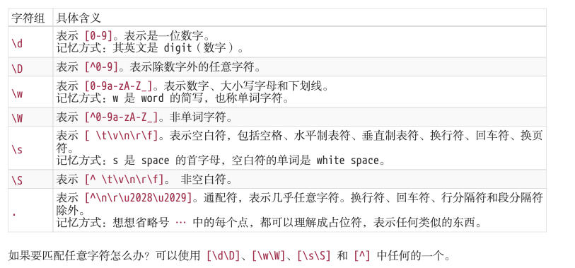
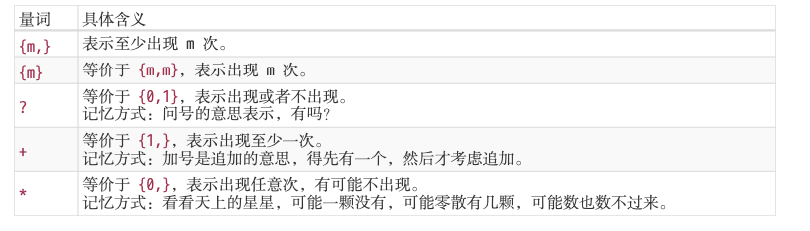
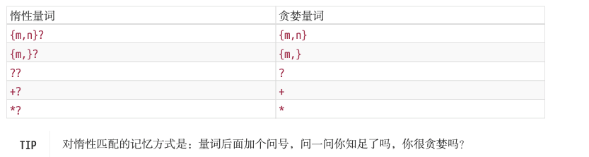

> <https://regex101.com/>

**正则表达式是匹配模式，要么匹配字符，要么匹配位置**

> **js开启 全局匹配 //g的时候 使用test() 匹配 会记录最后一次位置 再次匹配会从当前匹配的位置继续向后匹配**

[replace](https://developer.mozilla.org/zh-CN/docs/Web/JavaScript/Reference/Global_Objects/RegExp/test)

> 如果正则表达式设置了全局标志，test() 的执行会改变正则表达式   [lastIndex](https://developer.mozilla.org/en-US/docs/Web/JavaScript/Reference/Global_Objects/RegExp/lastIndex)属性。连续的执行test()方法，后续的执行将会从 lastIndex 处开始匹配字符串，([exec()](https://developer.mozilla.org/zh-CN/docs/Web/JavaScript/Reference/Global_Objects/RegExp/exec) 同样改变正则本身的 [lastIndex](https://developer.mozilla.org/en-US/docs/Web/JavaScript/Reference/Global_Objects/RegExp/lastIndex)属性值).

> **正则迷你书笔记**

# 两种模糊匹配

## 横向模糊匹配

- 横向模糊匹配： 正则匹配的字符串长度不固定的`{m,n}`的形式

```javascript
const reg = /a{1,3}/
```

## 纵向模糊匹配

- 纵向模糊匹配： 匹配某一位的字符时可以不是某个确定的字符，可以有多种可能

```javascript
 const reg  = /a[a-z]d/
```

此时的`[a-z]`被称为字符组 表示匹配一个字符 他可以是`a-z`的任意一个字符

而使用`[a称为-z]`连接的字符被范围表示法 用连字符 - 来省略和简写

# 字符组

> 匹配a - z 不能使用 \[a - z ] 应该写成\[a-z]\[-az]\[az-]

## 排除字符组

纵向模糊匹配，还有一种情形就是，某位字符可以是任何东西，但就不能是 "a"、"b"、"c"

```javascript
[^abc]
```

# 常见的简写形式



> JavaScript正则表达式迷你书

# 量词

量词也称重复


## 贪婪量词 与 惰性量词

> 通过在量词后面加个问号就能实现惰性匹配



# 排除字符组

纵向模糊匹配的一种情况就是排除字符组
例如在某个位置排除a b c 这三个字符 可以写成

> 字符组的第一位放 ^(脱字符)，表示求反的概念

```javascript
 const reg = /[^abc]/
```

# 多选分支

一个模式可以实现横向和纵向模糊匹配。而多选分支可以支持多个子模式任选其一。
具体形式如下:`(p1|p2|p3)` 其中 `p1`、`p2` 和 `p3`是子模式，用 |(管道符)分隔，表示其中任何之一

> 分支结构也是惰性的，即当前面的匹配上了，后面的就不再尝试了

# 位置匹配

可以将位置的所有匹配都当成是一个判断 最后的结果是他们取的并集

> 位置(锚)是相邻字符之间的位置
> `^、$、\b、\B、(?=p)、(?!p)`
> `(?=p)` 会一直往后匹配直到有合适的 则停止 从左往右
> `(?=p)` 就与 ^ 一样，就是`p`前面的那个位置。

位置的理解，我们可以理解成空字符 "" 字符之间的位置，可以写成多个（因为空字符可以有多个）

> 注意和`(?<=p)`和 `(?<!p)`的断言的方向
> `(?<=p)` 和 `(?<!p)`从右往左

## Demo

数字金额分割：

```javascript
   reg =  /(?!^)(?=(\d{3})+$)/g
```

金额变成 $ 1,234,00 的形式

```javascript
 reg = /(?!^)(?=(\d{3})+\.)/g
 nums.toFixed(2).replace(reg, ',').replace(/^/,'$$')
```

验证码 至少包含两种字符 密码在6-12位

```javascript
reg = /((?=.*[0-9])(?=.*[a-z])|(?=.*[0-9])(?=.*[A-Z])|(?=.*[A-Z])(?=.*[a-z]))^[0-9a-zA-Z]{6,12}$/


// 短信验证码 至少包含两种字符 密码在6-12位
reg = /((?=.*[0-9])(?=.*[a-z])|(?=.*[0-9])(?=.*[A-Z])|(?=.*[A-Z])(?=.*[a-z]))^[0-9a-zA-Z]{6,12}$/
console.log(reg.test('12345Az'));


// 另外一种写法 (?!)
// 这里不等于的情况 需要添加^ 不然位数不够也是true
// 因为这个前置符号会一直匹配到有的位置 往后移动 总有位数不够6的 则全部通过 添加^限制移动的位置 大于6位的开始校验 小于6位的位true
// 之后添加[0-9A-Za-z]{6,12}$ 限制 小于6的位数
reg = /((?!^[0-9]{6,12}$)(?!^[a-z]{6,12}$)(?!^[A-Z]{6,12})^[0-9A-Za-z]{6,12}$)/
```

# 括号的功能

> 提供了分组的功能

match 返回的一个数组，第一个元素是整体匹配结果，然后是各个分组(括号里)匹配的 NOTE 内容，然后是匹配下标，最后是输入的文本。另外，正则表达式是否有修饰符 g，match  返回的数组格式是不一样的。

```javascript
reg = /(ab)+/

str = 'abababa ababab abbaba'


console.log(str.match(reg)); // ['ababab','ab',index: 0,input: 'abababa ababab abbaba',groups: undefined ]

// 可以通过构造函数$1到$9获取 正则分组的结果
reg.test(str)

console.log(RegExp.$1); //ab

// 也可以用正则实例对象的exec的方法 获取正则匹配的属性

console.log(reg.exec(str));// ['ababab','ab',index: 0,input: 'abababa ababab abbaba',groups: undefined ]

```

# replace的技巧

```javascript
/**
 * 替换yyyy-mm-dd格式为mm/dd/yyyy
 * @param str
 * @returns
 */
function replaceDateFormat(str: string) {
  var reg = /(\d{4})-(\d{2})-(\d{2})/
  if (reg.test(str)) {
    var year = RegExp.$1;
    var month = RegExp.$2;
    var day = RegExp.$3;
  }
  var s: string = str;

  return s.replace(reg, function () {
    return day + '/' + month + '/' + year;
  })
  // 这样的写法等价于
   return s.replace(reg,'$3/$2/$1')

   // 也等价于
  s.replace(reg, function (match,year,month,day) {
    console.log(match); // 2020-01-02
    console.log(year);
    console.log(month);
    console.log(day);
    return day + '/' + month + '/' + year;
  })
}

console.log(replaceDateFormat('2020-01-02'));

```

# 反向引用

正则中的数字
\1 ... 等等 指代的是对应的分组()所引用的内容

```javascript
// 例如要求后一个分组匹配的字段要和前一个分组一致 则可以使用正则分组完成

reg = /\d{4}(-|\.|\/)\d{2}\1\d{2}/g

// console.log(reg.test('2022-01-02'));
// console.log(reg.test('2022.01.02'));
console.log(reg.test('2022/01/02'));
```

## 括号嵌套的情况

> 以左括号(开括号)为准

```javascript
reg= /^((\d)(\d(\d)))\1\2\3\4$/

console.log('1231231233'.match(reg));

// \1 = 123 \2 = 1 \3 = 23 \4 = 3
```


```javascript
如果真要匹配 \1 和 0 的话，请使用 (?:\1)0 或者 \1(?:0)。
```

(?:) 非捕获分组 匹配到的值不会保存起来

## 引用不存在的分组

```javascript
// 因为反向引用，是引用前面的分组，但我们在正则里引用了不存在的分组时，
// 此时正则不会报错，只是匹配 反向引用的字符本身。
// 例如 \2，就匹配 "\2"。注意 "\2" 表示对 "2" 进行了转义。
reg = /(\d)\1\2/

console.log(reg.test('11\2')); // true
```

## 分组之后的量词

分组后面有量词的话，分组最终捕获到的数据是最后一次的匹配

```javascript
reg = /(\d)+/

console.log('12345'.match(reg));
//[ '12345', '5', index: 0, input: '12345', groups: undefined ]
```

同理对于反向引用，也是这样的

## 非捕获分组

(?:p) 如果这是想要括号的最原始的功能 既不在API中引用他 也不在正则中反向引用他 可以使用非捕获括号

# match的解释

- 如果使用了g 则不会返回捕获数组 而是返回正则匹配的所有的结果
- 如果未使用g 则会返回正则匹配的第一个值 而且会返回其相关的捕获数组
    - - 捕获数组 第一个值是完整匹配 第二个值之后就是被捕获的数组 index是整个匹配开始的索引 input 是原始的解析的字符串 groups`MDN`给出的解释是即使有捕获组 需要定义命名捕获组的名称才会显示 不然就是`undefind`

## 命名捕获组

> reg = /(?ab)\1/
> 使用(?) 命名捕获组  在 replace() 方法的替换字符串中反向引用是用 `$<name>`

```javascript
reg = /(?<names>ab)\1/

console.log(str.replace(reg,'$<name>12'));
console.log(str.replace(reg,'$112')); //上述的$<name>与$1等价
```

- 使用命名捕获组 match和exec会多个 groups 属性，里面存放着每个命名分组的名称以及它们匹配到的值，利用 ES6 的解构语法，可以方便的提取出想要的字段。注意这个 groups 属性只有在当前正则里至少存在一个命名分组的前提下才会存在。
- 在replace中 第二个可以使用这个命名捕获组 而且如果第二个参数是个函数 实参列表的末尾会多传一个groups的对象 如果没有命名分组 这个参数会不存在 则为空字符串

```javascript
str = 'abababa ababab abbaba'
reg = /(?<names>ab)\1/
console.log(str.replace(reg,'$<name>')); //aba ababab abbaba
```

> 分组名不能重复 重复了会报错

```javascript
 reg = /(?<names>ab)(?<names>ab)/ //会报错
```

## Demo

匹配出字母 p，但要求 p 前面不可以是 a，p后面不可以是 z。

```javascript
/(?<!a)p(?!z)/
```
