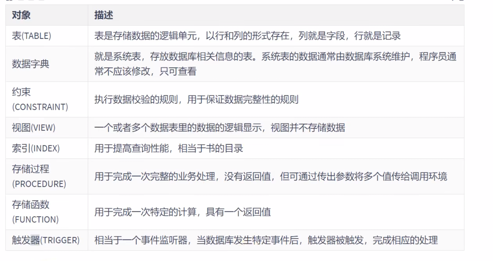
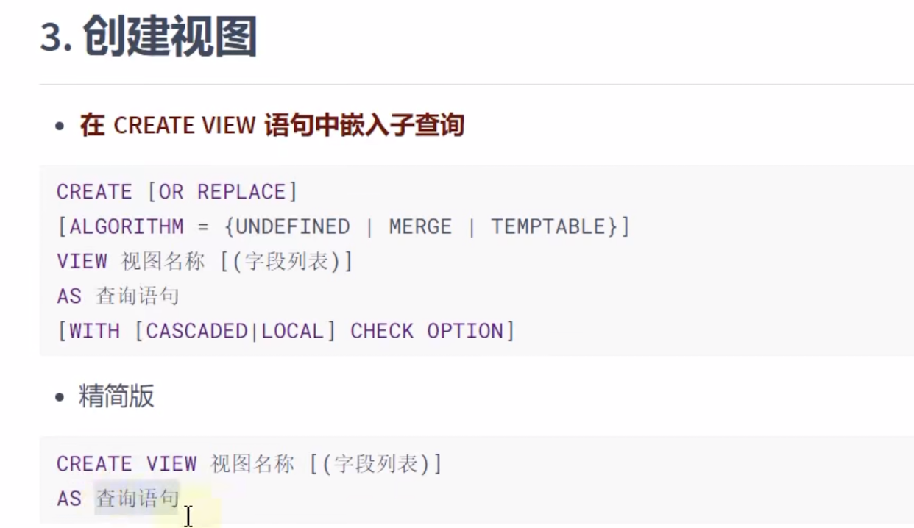
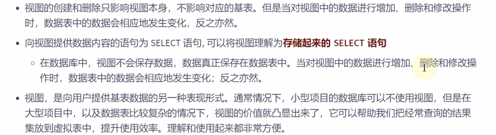
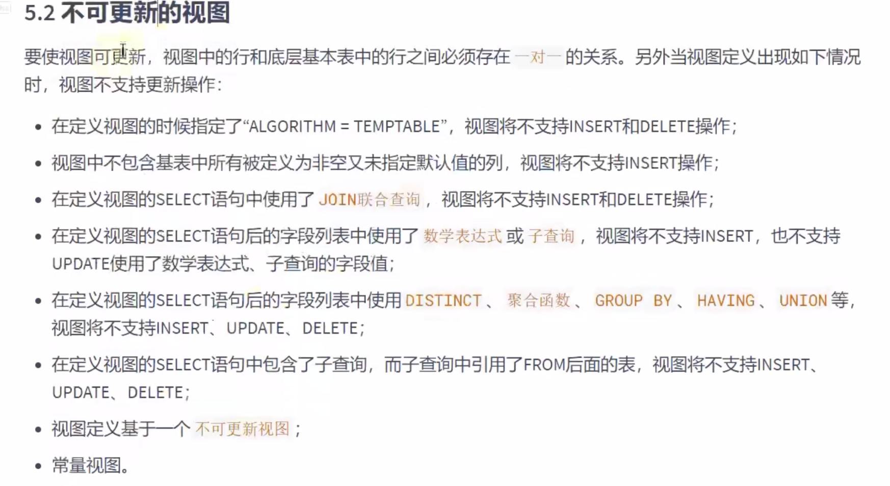
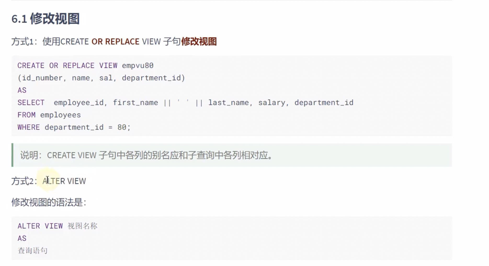
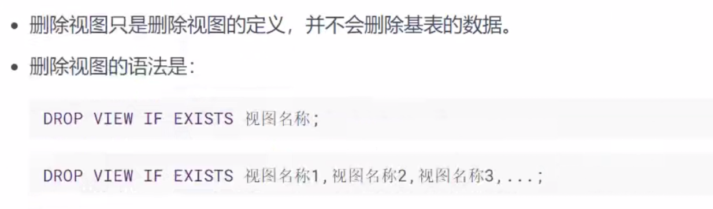

```sql
# 视图相当于一个基本表

# 复制这个表
create table emp1 as
select *
from atguigudb.employees;


select *
from emp1;

# 创建视图
create view emp_view
as
select employee_id, first_name, last_name
from emp1;

# 查询视图 一般查询语句中的别名会作为视图中的字段显示
select *
from emp_view;

# 视图使用字段别名的方式
# 也可以查询出表中没有的 比如 avg count等
# 也可以做多表链接的视图
create view emp_view1(id, name, salary)
as
select employee_id, first_name, last_name
from emp1;

select *
from emp_view1;

use atguigudb;

# 利用视图对数据进行格式化
create view emp_depart
as
select concat(last_name, '(', department_name, ')') as emp_dept
from employees
         join departments d on employees.department_id = d.department_id


select *
from emp_depart;

select *
from emp1;

# 基于视图创建视图
create view ui_emp4
as select salary
from emp1;

select *
from ui_emp4;


# 查看视图
show tables ;
# 查看视图结构
desc emp1;
describe emp1;

# 查看视图属性
show table status like 'emp1';

# 查看视图的详细定义信息
show create view atguigudb.ui_emp4;
```

> 删除和新增 修改都会修改原表（可能还会更新失败）



# 修改视图






```sql
 create or replace // 创建或者替换
```
