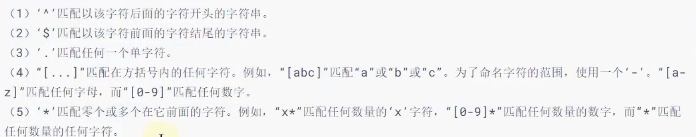
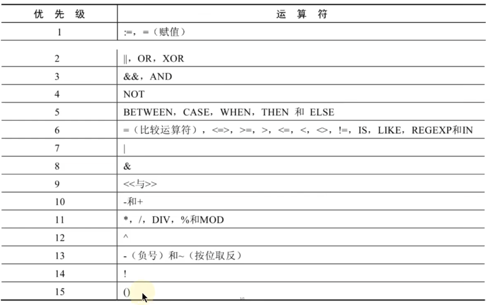

# 算术运算符

1. - (+号没有连接的作用 就是表示的是加法运算 此时 字符串会被转换成数值(隐式转换) 字母看作是0处理)
2. -
3. %(mod)

```java
select 12%3, 12%5, -12 mod 3, -12 mod 5;
// 0 2 0 -2
// 正负结果为 被除数的正负
```

4. /(div)
5. -


# 比较运算符

比较运算符对表达式左边的操作数和右边的操作数进行比较 比较的结果为真则返回1 比较的结果为假则返回0 其他情况则返回null

> 字符串存在隐式转换
> 如果两边比较的都是字符串 则会按照字符的ANSI编码判断是否相等
> 有null判断 结果就为null

|&#x20;
&#x20;|  |  |
| --- | --- | --- |
| = | 等于运算符 |  |
| <=> | 安全等于运算符 | null值参与比较不会为null(其余与等于运算符相同) |
| <>（!=） | 不等于运算符 |  |
| < |  |  |
| <= |  |  |
| > |  |  |
| >= |  |  |

```sql
select null <=> null
from dual;
// 1
```

| is null | 判断值 字符串或者表达式是否为空 | select department\_id from departments where department\_id is null
� |
| --- | --- | --- |
| is not null |  |  |
| least | 返回多个值中的最小值 | select D from table where c > least(a,b) |
| greatest | 返回多个值中最大返回值 |  |
| between and | 判断一个值是否在两个值之间（包含边界值） | select d from table where between a and b |
| isNull() | 判断一个值是否为空 | select d from table where isNull(a) |
| in | 判断一个值是否是列表中的任意一个值 | select d from table where c in(a,b)&#x20;
// c是否是a,b 单中的一个值 |
| not in | 一个值是否不是一个列表中的任意一个值 |  |
| like | 判断一个值是否符合模糊匹配规则 | % 代表不确定个数的字符(0个 1个 或者多个)
\_ 代表一个不确定的字符
转义字符: \\
&#x20;\\\_ => \_ |
| regexp | 判读一个值是否符合正则表达式的规则 | select d from table where regexp b |
| rlike | 判断一个值是否符合正则表达式的规则 | select d from table where rlike b |

> is not null 用is null 代替

```sql
select *
from departments
where not department_id is null;
```


## like

```sql
select *
from departments
where department_id like '_$_a';
```

> 使用别的字符作为转义字符

```sql
select *
from departments
where department_id like '_$_a' escape '$';
```


## or

```sql
select *
from departments
where a > 100 or a = 12; // or的使用
```


# 


## length

length（string）


# 逻辑运算符

| not 或 ! |  |  |
| --- | --- | --- |
| and 或&& |  |  |
| or 或 || |  |  |
| xor | 逻辑异或 | 不同为 1 相同为0 |

> and 优先级 高于or优先级


# 优先级



> 数字越大 优先级越高
> \~优先级高


# 位运算符

| & | 按位与 |  |
| --- | --- | --- |
| | | 按位或 |  |
| ^ | 按位异或 |  |
| ~ | 按位取反 |  |
| >> | 按位右移 |  |
| << | 按位左移 |  |

```sql
# 工资不在5000-12000的员工
select last_name,salary
from employees
where salary not between 5000 and 12000;

# 选择在20 或50号部门工作的员工姓名和部门号

select last_name,manager_id
from employees
where department_id = 20 or department_id = 50;

# 在公司中没有管理者的员工姓名及job_id
select last_name,job_id
from employees
where manager_id is null ;

# 选择公司中有奖金的员工姓名 工资和奖金级别
select last_name,salary,commission_pct
from employees
where commission_pct is not null;

# 选择员工姓名的第三个字母是a的员工姓名
select last_name
from employees
where last_name like '__a%';

# 选择姓名中有字母a和k的员工姓名
select last_name
from employees
# where last_name like '%a%k%' or last_name like '%k%a%';
where last_name like  '%a%' and last_name like '%k%';
# 表employees表中 first_name 以 'e'结尾的员工信息
select first_name
from employees
# where first_name like '%e';
where  first_name regexp 'e$';
# 显示 部门编号在80 - 100 之间的姓名 工种

select last_name,job_id
from employees
where department_id between 80 and 100;

# 显示managerId 是 100 101 110的员工的姓名 工资 管理者id
select  last_name,salary,manager_id
from employees
where manager_id in (100,101,110);
```
