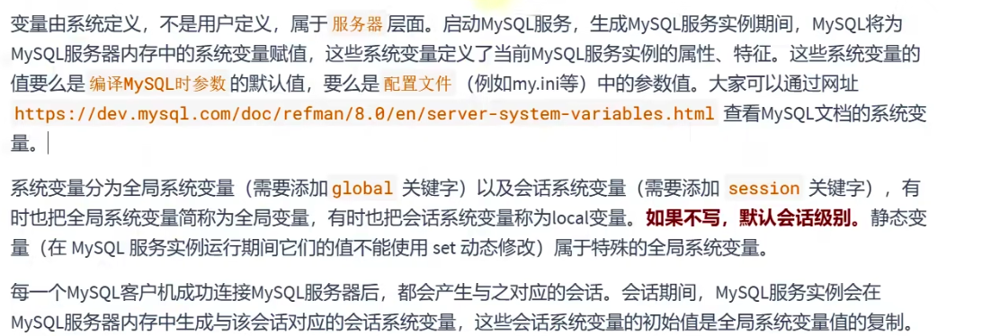
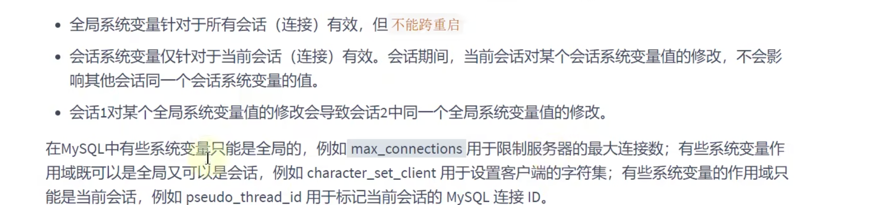
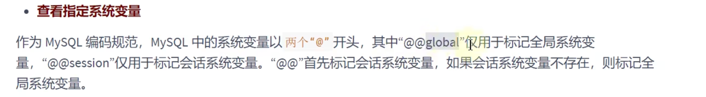
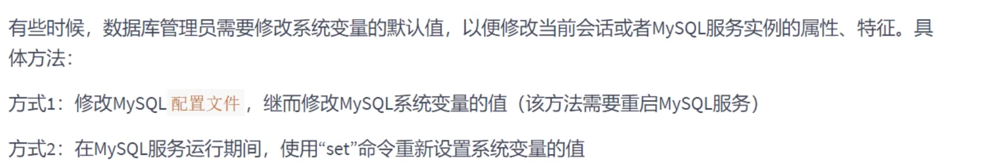
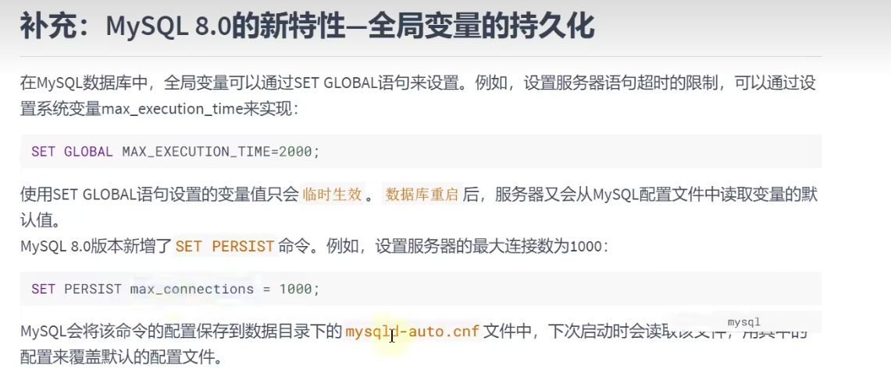

在MySQL数据库的存储过程和函数中，可以使用变量来存储查询或计算的中间结果数据，或者输出最终的结果数
据。
在MySQL数据库中，变量分为**系统变量**以及**用户自定义变量**。

## 系统变量




```sql
# 查询 所有的全局变量
show global variables;


# 查看所有的会画变量
show session variables;

show variables ;


# 查看部分的系统全局变量
show global variables like '%max_connections%';

show variables like 'character_%'
```



```sql
# 查看指定的系统变量
select @@global.max_connections;

select @session.character_set_client;

select @@character_set_client;
```



```sql
# 1.
set @`session.character_set_client` = 'utf8';
# 2.
set session  character_set_client = 'utf8';
```

重启之后 全局系统变量会失效

## 用户变量


### 会话用户变量

使用@符开头 作用域为当前会话

```sql
# 两种方式声明赋值
set @var = 值;
set @var := 值;

# 第二种方式
select @用户变量 := 表达式[Form 等子句];
select 表达式 into @var [Form 等子句];
```


### 局部变量

只能使用在存储过程和存储函数中的变量
可以使用`declare`定义一个局部变量
仅在`begin end`作用域中有效

```sql
# DELCARE 变量名 类型 [default 值]; # 没有default 则为null
DECLARE var int default 100;
# 赋值
# set 变量名 = 值；
# set 变量名 := 值；
# select 字段名或者表达式 into 变量名 from 表；

# 使用变量
# select 局部变量名
```

```sql
delimiter //

 create procedure test_var()

begin
    declare aaa int default 1;


    select aaa;
end //

delimiter ;

call test_var() # 调用存储过程
```


## 定义错误条件

```shell
declare command_not-allowed condition for 1148
```


