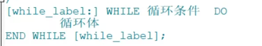
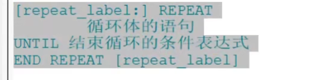

<a name="jfcLi"></a>

## if 结构

```sql
delimiter //

create procedure test_var()

begin
    if stu is null
    then
        select 'stu_name is null';
    else
        	select 'email is not null';
    end if;
end
//

delimiter ;

```

<a name="wzy9Q"></a>

## case 结构

```sql
case 表达式

when 值1 then ...

else ...
end case;
```

<a name="L06cE"></a>

## while

 <a name="FE0Nl"></a>

##  loop

```sql
[loop_label:] Loop
	循环语句
end loop[loop_label]


delimiter //

create procedure test_var()

begin
    declare avg_sal int default 0;
      loop_b: loop
        if avg_sal > 100
            then leave loop_b;
        end if;
            set avg_sal = avg_sal + 1;
      	else ...
         end loop loop_b;
end //

delimiter ;

```

<a name="drfIe"></a>

## repeat

 <a name="owYvX"></a>

## 跳转语句

<a name="aMK61"></a>

## leave

跳出循环 或者存储过程体

```sql
delimiter //

create procedure test_var()

test:begin
    declare avg_sal int default 0;
        if avg_sal > 100
            then leave test;
            set avg_sal = avg_sal + 1;
            end if;
end //

delimiter ;
```

<a name="xQL7S"></a>

## iterate

只能用在循环语句 loop repeat while 语句 表示重新开始循环(类似continue)

```sql
iterate label
```

```sql
delimiter //

create procedure test_var()

test:
begin
    declare avg_sal int default 0;

    if avg_sal > 100
    then
        iterate test;
    else
        if avg_sal = 101
        then
            leave test;
        end if;
        set avg_sal = avg_sal + 1;
    end if;
end
//

delimiter ;

```
