存储过程与存储函数

> 函数都有返回值

<a name="mOHaV"></a>

## 存储过程

一组经过预先变异的sql语句的封装

- 简化操作 提高了sql语句的重用性
- 提高效率
- 减少网络传输量
- 减少sql语句暴露的风险 提高安全性

存储过程没有返回值
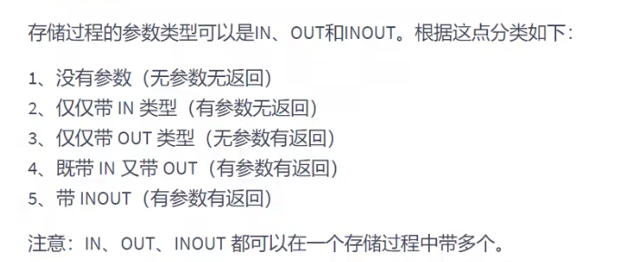

```sql
// in 传进来 out 传出去out
create producdure 存储过程名(in | out | inpout 参数名 参数类型,)
[characterostocs ...]
begin
   存储过程体

   end
```

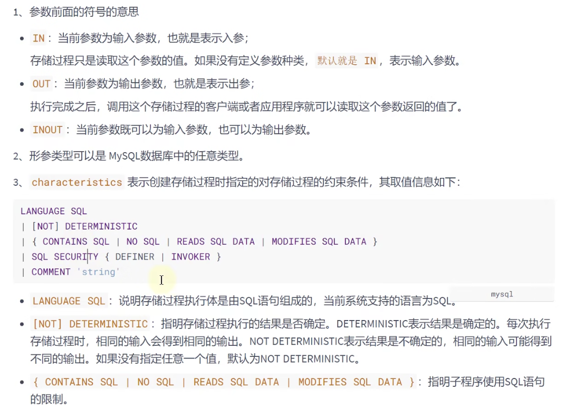
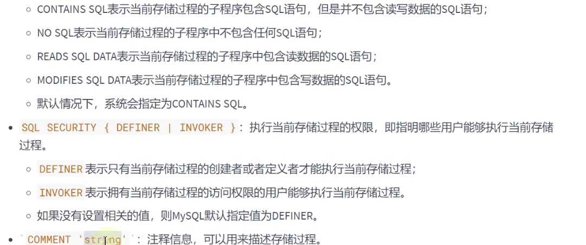&#x20;
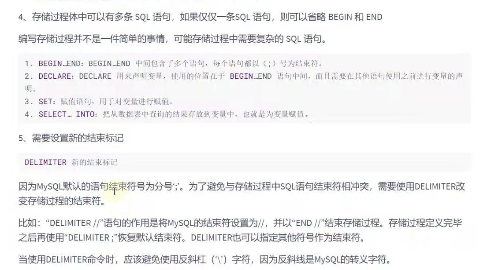

```sql
delimiter $ //定义结束的标识


create procedure select_all_data()
begin
  select * from emps; //如果没有定义delimiter 标识的标志 则认为;是结束标志 没用到end就报错
   end $
   delimiter  //重置结束标识
```

```sql
# 创建存储过程
delimiter $

create procedure dv_emp_proc()
begin
    select *
    from dv_emp;
end $

delimiter ;

# 存储过程的调用
call dv_emp_proc();

# 创建存储过程 返回员工的平均工资
delimiter $
create procedure dv_emp_proc_svg()
begin
    select avg(salary)
    from dv_emp;
end $
delimiter ;

call dv_emp_proc_svg();

# 创建存储过程show_max_salary() 查看emps表最高薪资值

delimiter $
create procedure show_max_salary()
begin
    select max(salary)
        from dv_emp;
end $
delimiter ;

// 调用存储过程
call show_max_salary();
```

<a name="SE1Vu"></a>

## 带out的存储过程

out可以输出值

```sql
# --------------------------------------------------------
# 创建带out的存储过程
# 创建存储过程show_min_salary(), 查看emps 表的最低薪资值 并将最低薪资通过OUT参数'ms'输出
show databases;

use atguigudb;

desc employees;

delimiter //

create procedure show_min_salary(out ms double)
begin
    select min(salary)
    into ms # 将结果写入到ms中
    from employees;
end //

delimiter ;

# 回调
call show_min_salary(@ms);
# @ms 为变量
select @ms;

# --------------------------------------------------------
```

<a name="t3b7E"></a>

## 带 in的存储过程

in可以输入值

```sql
create procedure show_someone_salary(in empname varchar(20))
begin
    select salary
    from employees
    where first_name = empname;
end //
delimiter ;

select *
from employees;

# 删除存储过程
drop procedure show_someone_salary;
# 调用方式1
call show_someone_salary('Steven');
# 调用方式2
# 用户定义的变量为一个@xxx
# 系统定义的变量为@@xxx
set @empname = 'Steven';

call show_someone_salary(@empname);
```

<a name="OPPbs"></a>

## 带in 和out的存储过程

```sql
##类型4：带IN和OUT
#举例6：创建存储过程show someone salary2(),查看"emps"表的某个员工的薪资，
#并用IN参数empname?输入员工姓名，用oUT参数empsalary输出员工薪资。
use atguigudb;
show tables;

desc employees;

delimiter //
create procedure show_someone_salary2(in empname varchar(20), out empsalary double(8,2))
BEGIN
    select  count(salary)  into empsalary
    from atguigudb.employees
    where first_name = empname;
end //

delimiter ;

## 删除存储过程
drop procedure show_someone_salary2;


call show_someone_salary2('Steven', @empsalary);

select @empsalary;
```

<a name="KwC8U"></a>

# 存储函数

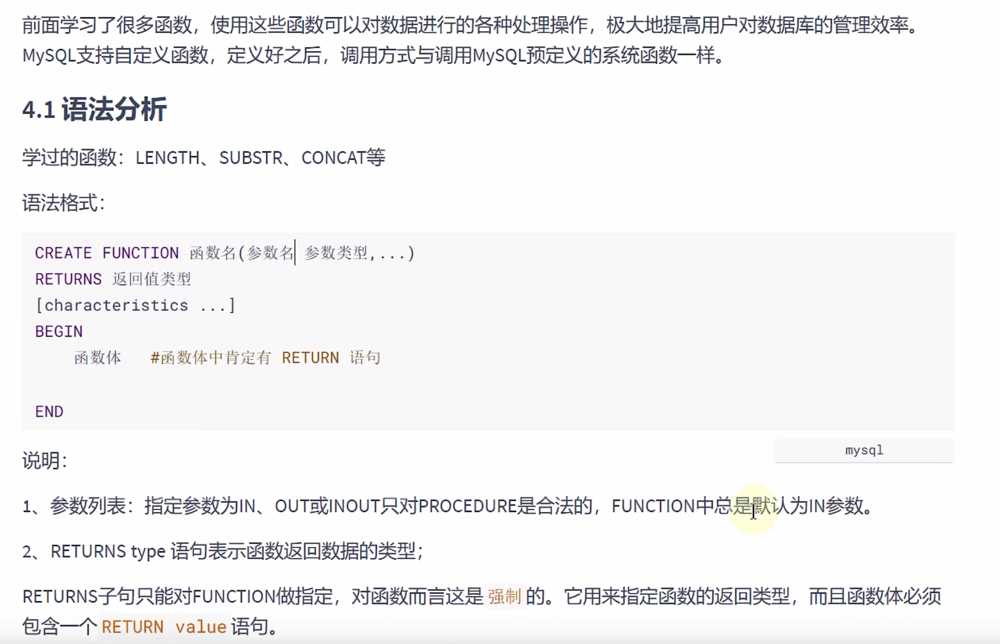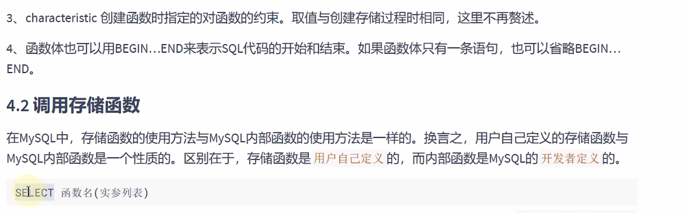

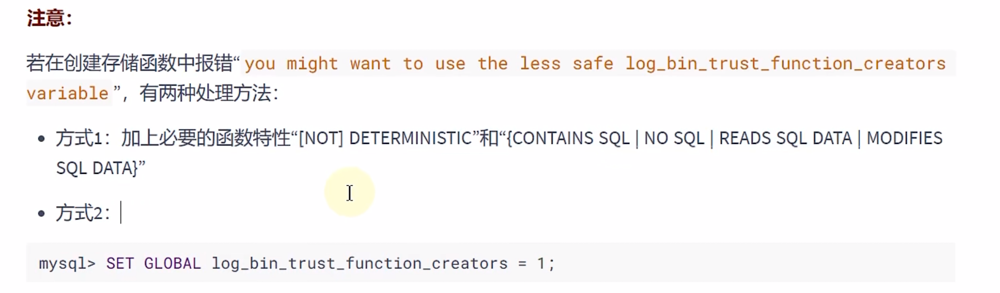

```sql
#举例1：创建存储函数，名称为emai1 by name(),参数定义为空，
#该函数查询Abe1的emai1,并返回，数据类型为字符串型。

delimiter //

create function email1_by_name()
    returns varchar(25)
    # 这里就是characteristic的定义
    deterministic#每次输入都有确定的输出值
    reads sql data # 读取的sql
    contains sql# 包含sql
begin
    return (select email
            from employees
            where last_name = 'Abel');
end //

delimiter ;

drop function email1_by_name;

set @email = 'Abe1';
# 调用过程
select email1_by_name();
```

> SET GLOBAL log\_bin\_trust\_function\_creators =  1; // 关闭函数特征检测

```sql
delimiter //
create function count_by_id(dept_id int)
    returns int
    deterministic
    reads sql data
    contains sql
begin
    return (select count(*)
            from employees
            where department_id = dept_id);
end //

delimiter ;

set @dept_id = 50;
select count_by_id(@dept_id);
```

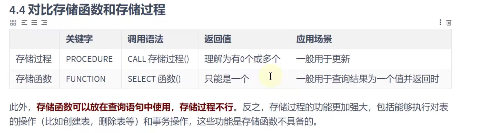 <a name="Y7V4Y"></a>

# 存储过程的修改 查看 删除

<a name="ElS2X"></a>

## 查看

1. show create

```sql
# 存储过程和存储函数的查看
show create function count_by_id;

show create procedure  show_someone_salary2;

# 查看全部的存储过程
show procedure status;

# 查看某些存储过程
show procedure status like '%show_%';

# 查看某些存储函数
show function status like '%email%';

# 从information_schema中查看存储过程和存储函数
select *
from information_schema.ROUTINES
where ROUTINE_NAME = 'show_someone_salary2' and ROUTINE_TYPE = 'PROCEDURE';
```

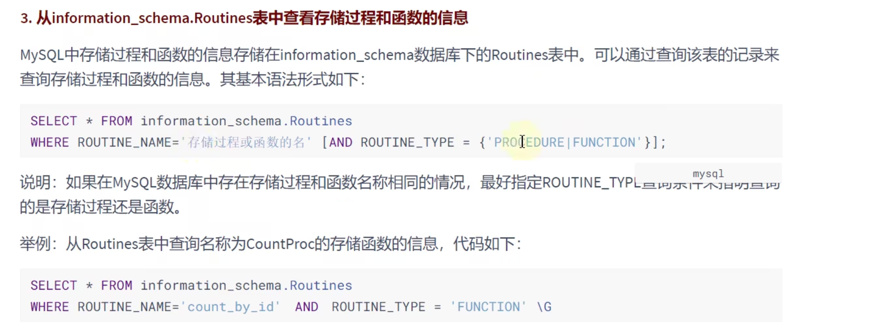

```sql
# 修改查询类型
alter procedure show_someone_salary2
sql security invoker comment '查询某个员工的薪资';
```

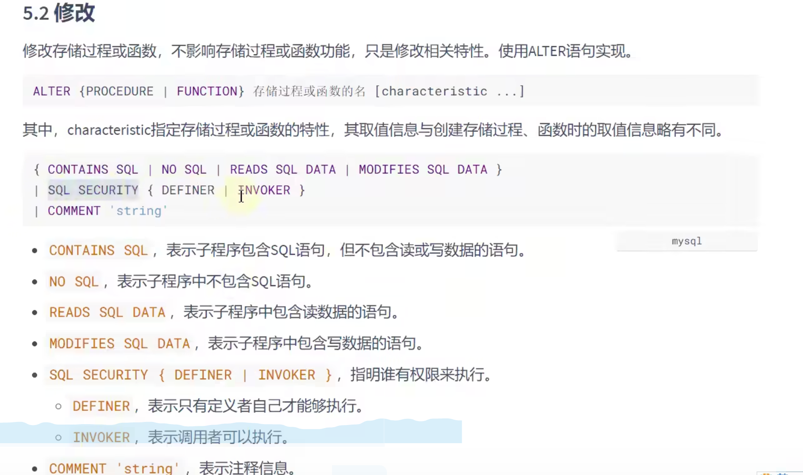

```sql
# 删除函数类型
drop function email_by_id;
```

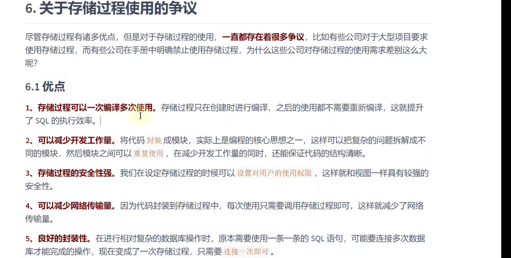
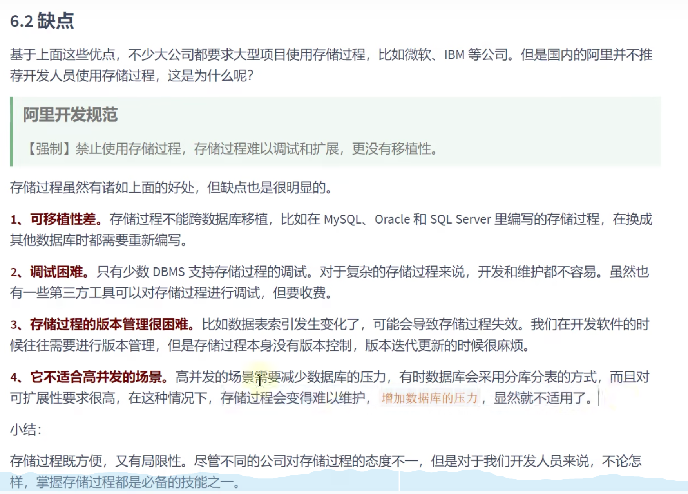 <a name="aO9aq"></a>

## 存储过程练习

```sql
# 存储过程练习
create database test15_pro_func;

use test15_pro_func;

create table admin
(
    id        int primary key auto_increment,
    user_name varchar(20) not null,
    password  varchar(25) not null
);

delimiter //
create procedure insert_user(in user varchar(20), in ps varchar(25))
# 创建存储过程
begin
    insert into admin(user_name, password)
    values (user, ps);
end //

delimiter ;

select *
from admin;

call insert_user('admin', '123456');


create table beauty
(
    id    int primary key auto_increment,
    name  varchar(20) not null,
    phone varchar(15) unique,
    birth date
);

delimiter //

create procedure get_phone(in i int, out n varchar(20), out p varchar(20))
begin
    select name, phone
    into n,p
    from beauty
    where id = i;
end //

delimiter ;


insert into beauty(name, phone, birth)
values ('朱茵', '13201233453', '1982-02-12'),
       ('田腹甄', '13651238755', '1983-08-21'),
       ('孙燕姿', '13501233653', '1980-12-09'),
       ('邓紫棋', '17843283452', '1991-11-12'),
       ('刘若英', '18635575464', '1989-05-18'),
       ('杨超越', '13761238755', '1994-05-11')

set @name = "朱茵";
set @phone = "13201233453";
call get_phone(2, @name, @phone);

select @name;
select @phone;

delimiter //
create procedure date_diff(in d1 date, in d2 date, out d int)
begin
    select ABS(DATEDIFF(d1, d2))
    into d
    from dual;
end //


delimiter ;

drop procedure date_diff;

set @d1 = '1982-02-12';
set @d2 = '1983-08-21';
set @d = @d1;
call date_diff(@d1, @d2, @d);

select @d;

delimiter //
create procedure format_date(in d date, out s varchar(25))
begin
    select DATE_FORMAT(d, '%Y年%m月%d日')
    into s
    from dual;
end //

delimiter ;
call format_date('1983-08-21', @s);

select @s;

delimiter //
create procedure add_double(inout d1 double, inout d2 double)
begin
    set d1 = d1 * 2;
    set d2 = d2 * 2;
end //
delimiter ;

drop procedure add_double;

set @out1 = 1.2;
set @out2 = 2.3;
call add_double(@out1, @out2);
select @out1;
select @out2;
```

<a name="LwzQX"></a>

## 存储函数练习

```sql

# 存储函数练习
delimiter //
create function get_count()
    returns int
    deterministic
    contains sql
    reads sql data
begin
    return (select count(*)
            from atguigudb.employees);
end //
delimiter ;

select get_count();


delimiter //
create function ename_salary(emp_name varchar(15))
    returns double
    deterministic
    contains sql
    reads sql data
begin
    return (select salary
            from atguigudb.employees as empd
            where empd.last_name = emp_name);
end //

select *
from atguigudb.employees;

select ename_salary('Kochhar');

delimiter ;

select *
from atguigudb.employees;
select *
from atguigudb.departments;
desc atguigudb.employees;
delimiter //
create function dept_sal(dept_name varchar(20))
    returns double
    deterministic
    contains sql
    reads sql data
begin
    return (select avg(salary)
            from atguigudb.employees as empd
            where empd.department_id = (select dep.department_id
                                        from atguigudb.departments as dep
                                        where dep.department_name = dept_name));
end //
delimiter ;


select *
from atguigudb.departments;
select dept_sal('Marketing');

delimiter //
create function add_float(value1 float, value2 float)
    returns float
    deterministic
    contains sql
    modifies sql data
begin
    return (value1 + value2);
end //

delimiter ;

select add_float(1.2, 2.3);
```
