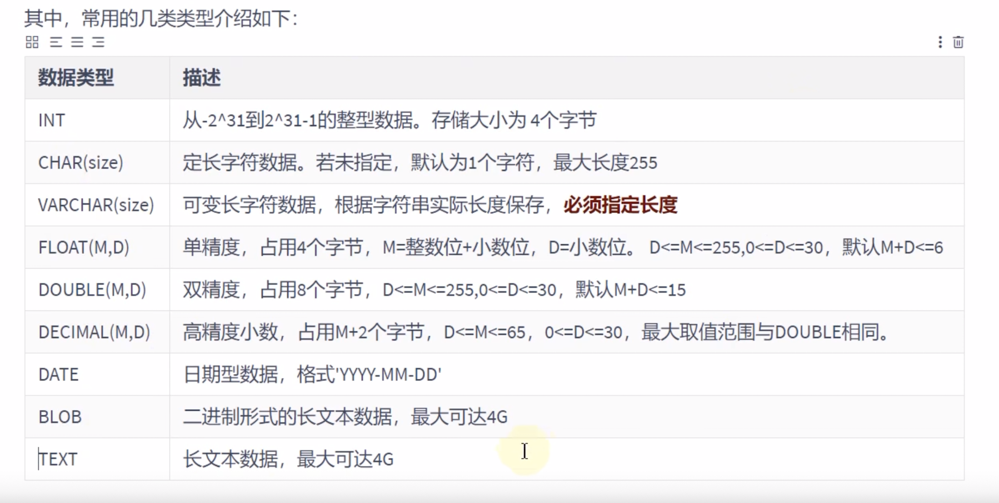
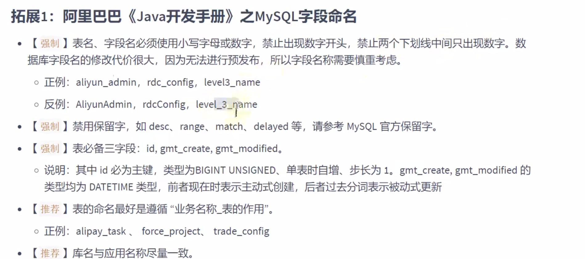
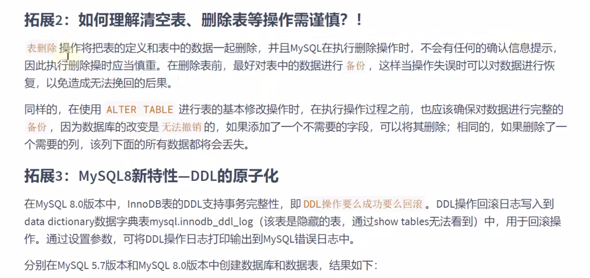
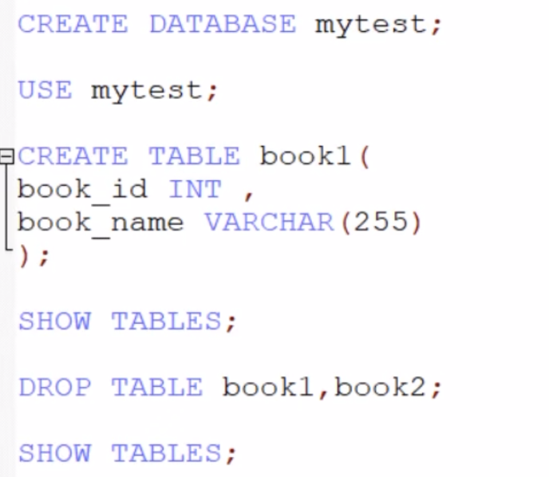

# 数据类型


> DECIMAL的精确度更高
> 

创建表:
shwo create database xxx;

> create table

```sql
// 如果没有这个表 则创建
create table if not exists t {
}
```


# 查看表结构

> desc tableName;
> show create table xxx;
> 如果创建的表没有指明字符集 则会引用该数据库的字符集 如果该数据库没有字符集 则会引用配置文件的字符集


# 基于现有的表创建表

```sql
create table mydb
as select employee_id
from employees
```

```sql
# 创建表employees_copy 实现对employees表的复制 包括表数据
create table employees_copy
as select * from employees;

# 创建表 employees_blank 实现对employess表的复制 不包括表数据

create table employees_blank
as select * from employees where 1 = 2;
```


# 修改表


## 添加一个字段

```sql
# 添加字段
alter table emp1
    # double(10,2) 一共有10位 小数点后面有2位
    add salary double(10, 2);

# 添加字段并且指定位置
alter table emp1
    add phone_number varchar(20) first; #

alter table emp1
    add email varchar(20) after id;
```


## 修改一个字段

> change用来字段重命名，不能修改字段类型和约束；

> modify不用来字段重命名，只能修改字段类型和约束

```sql
# 修改一个字段
# 可以修改字段的数据类型 长度和默认值等
alter table emp1
    modify phone_number varchar(25) default null;
# 重命名一个字段(重命名的时候也可以修改字段的属性)
alter table emp1
    change phone_number phone double(10, 3);

```


# 删除一个字段

```sql

# 删除一个字段
alter table emp1
    drop column email;
```


# 重命名表

```sql
# 重命名表
rename table emp1
to emp2
# 第二种方式
alter table emp2
rename to emp1
```


# 删除表

不光删除的表的结构 同时表的数据也清空

```sql
# 删除表
drop table if exists employees_blank;
```


# 清空表

```sql
# 清空表操作
truncate employees_copy;
select *
from employees_copy;
```


## truncate 和 delete的区别

```sql
truncate employees_copy
和 delete employees_copy 都可以对表的数据进行删除 并且保留表的数据

不同的是： truncate table  一旦执行了此操作 表数据会被全部清除 同时 数据是不可以回滚的
delete from 一旦执行此操作 表数据可以全部清除（不带where） 同时数据是可以实现回滚的
```

> DDL 和 DML的不同
>
> 1. DDL 的操作一旦执行 就不可以回滚 不支持指令set autocommit = false （执行完ddl操作之后 一定会执行一次 commit）
> 2. DML操作的默认情况 也是不能回滚的 设置一个参数 在执行DML之前 执行了 set autocommit = false 则执行的DML的操作就可以回滚

truncate 比delete 速度快 而且使用的系统和事物日志资源少 但 truncate 无事物且不出发trigger 有可能造成事故 **建议在代码中使用delete**

```sql
drop table employees_copy;

create table employees_copy
as select * from employees;

select * from employees_copy;
set autocommit  = false; # 支持回滚操作

delete from employees_copy;

rollback;
select *
from employees_copy;
```

> 表明\_业务
> unsigned 无符号





# demo

```typescript

create table if not exists customers
(
    c_num     int(7),
    c_name    varchar(50),
    c_contact varchar(50),
    c_city    varchar(50),
    c_birth   date
);

# 将 c_contact字段移动到c_birth字段后端
alter table customers
    modify c_contact varchar(50) after c_birth;
# 将c_name 字段数据类型改为 varchar(70)
alter table customers
    modify c_name varchar(70);

# 将c_contact 字段改名为c_phone
alter table customers
    change c_contact c_phone varchar(50);

# 新增c_gender 字段到 c_name后面 数据类型为char(1)
alter table customers
    add c_gender char(1) after c_name;

desc customers;

rename table customers to customers_info;


# 删除字段c_city
alter table customers_info
    drop column c_city;

desc customers_info;
```


# DML 的增删改操作


## 增加数据

> values 也可以写成value 但是 values是规范

```sql
# 一条一条添加数据 按照声明字段的先后顺序添加
# 字段需要按照声明字段的顺序添加
desc emp1;
insert into emp1
values (123, '123', 1234);

#2.指明要添加的字段（推荐使用 ）
insert into emp1(id, phone, salary)
values ('1234', 123, 12345);
```


### 插入多条记录

```sql
# 同时插入多条记录
insert into emp1(id, phone, salary)
    value ('1234', 12345, 1234),
    ('1', 1, 1)
```


### 将查询出来的结果进行插入

```sql
insert into emp1(id, phone, salary)
select employee_id, 1, salary
from atguigudb.employees
where salary > 1000
```


## 更新操作

> update 可以实现批量修改数据的

修改的数据如果受到约束的影响 有可能更新不成功

```sql
# 更新操作 一般都会根where筛选 不然更新全表
update emp1
set id = 123
where id = 1
```

更新多个字段

```sql
# 更新多个字段
update emp1
set phone = 1,id = 12
where salary = 1234;
```


## 删除操作

> 也可能受到约束的影响 删除也会不成功

```sql
delete from emp1
where id = 1;
```


# sql8.0新增列

```sql
# 8.0的新特性 计算列

create table tb1(
    id int,
    a int,
    b int,
    c int generated always as (a + b) virtual # c就是一列计算列
);

insert into tb1(a,b)
value (10,20);

```
