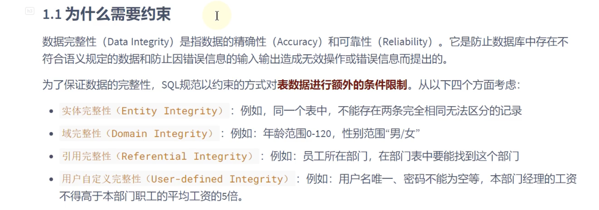
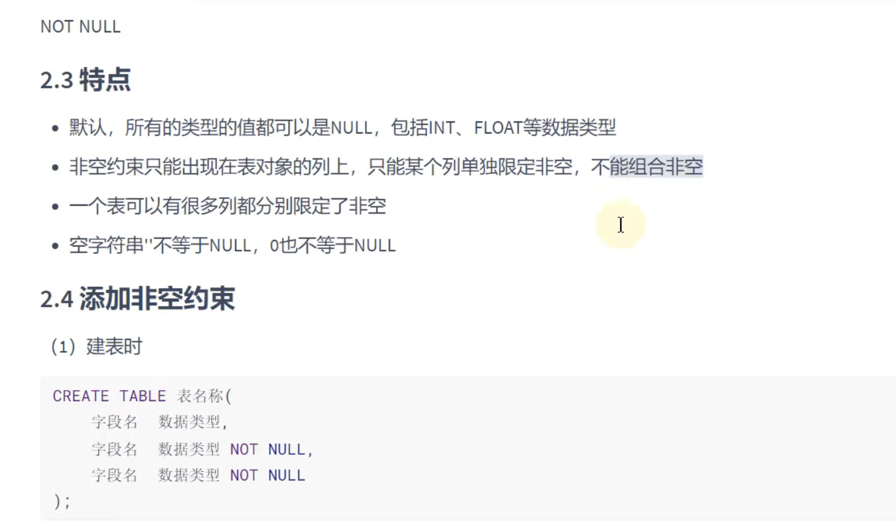
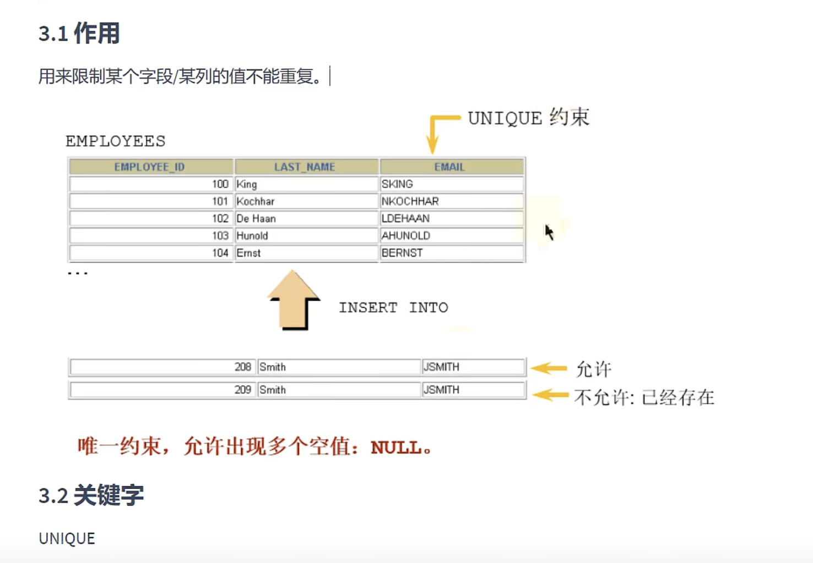
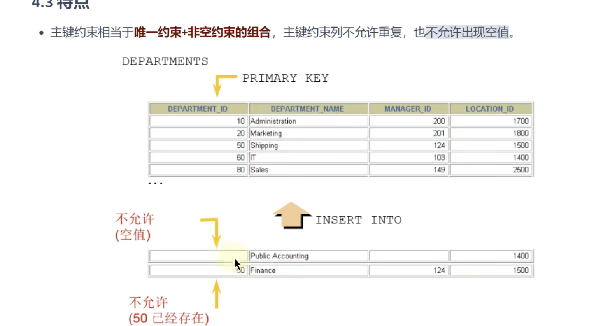
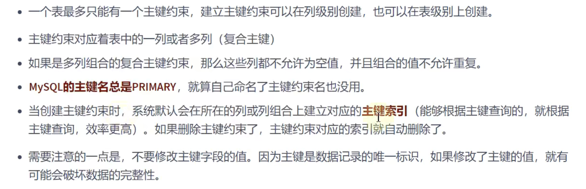
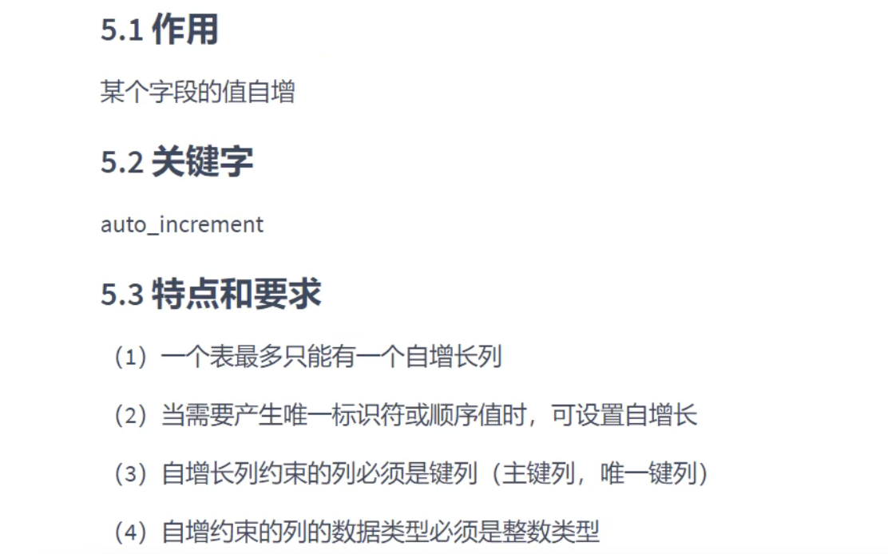
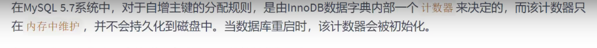
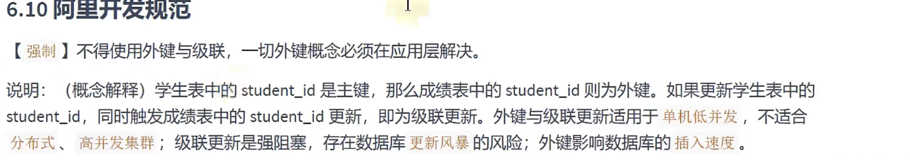
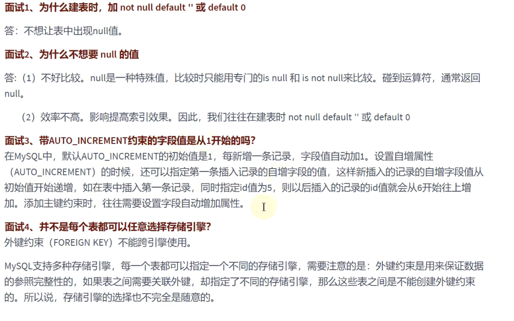

# 约束



# 约束的作用范围


## 列级约束

将此约束声明在对应的字段的后面

## 表级约束

在表中的所有字段都声明完 在所有字段的声明的后面添加约束

# 约束的作用

- not null 非空约束
- unique 唯一约束
- primary key 主键约束
- foreign key 外键约束
- check 检查约束
- default 默认值约束

# 添加约束

create table时添加约束
alter table 时增加约束 删除约束

### 查看约束

```sql
select * from information_schema.TABLE_CONSTRAINTS
where TABLE_NAME = 'employees';
```

```sql
# 修改约束
alter table test01_library.test03_companyd
    modify `is` varchar(255) not null;

# 删除约束
alter table test01_library.test03_companyd
modify `is` varchar(255) null ;
```






可以向声明unique的字段上添加null值 而且可以多次添加null值

## 表级约束

```sql

create table test3
(
    id        int unique,
    last_name varchar(255),
    # 表级约束
    constraint uk unique(id)
);
```

添加约束

```sql
alter table tes2
# 这里想弹雨添加了一个复合约束
add constraint uk_test_sal unique(salary,id)

alter table tes2
modify last_name varchar(15) unique;
```


# 删除唯一性的约束

添加唯一性约束的列上会自动创建唯一索引
删除唯一约束只能通过删除唯一索引的方式删除
删除时需要指定唯一索引名字 唯一索引名就是和唯一约束名一样
如果创建唯一约束时未指定名称 单列的话默认和列名相同 多列的话默认和第一个列名相同 也可以自定义唯一约束名

```sql
show index from test3;
# 删除唯一索引
alter table test3
drop index uk;
```

> 可以通过show index from 表名称 查看表的索引


# 主键约束



主键约束 ： 非空且唯一

表级约束和列级约束的区别：

```sql
create table t(
  id int primary key # 列级约束
)
cteate table t1(
  id int ,
  constraint pk_id5 primary key(id) # 表级约束 起名字没有作用  主键名总是primary
  )


```

```sql
# 添加主件约束
alter table test3
add primary key (id);

# 删除主件约束
alter table test3
drop primary key;
```


# 子增列



> 向主含有(auto\_increment)的字段添加0或者null的时候 会自动往上添加值

```sql
insert into demo3(id,name)
values (null,'tom');

insert into demo3(id,name)
values (0,'tom');
```

在alter table添加主键约束

```sql
alter table d
modify id int auto_increment
```

删除主键约束

```sql
alter table d
modify id;
```

唯一键和主键都是通过删除唯一索引和主索引来删除的 所有用的搜时drop 而修改类型用的是modify

# sql5.7在内存中维护了一个auto\_increment

一个字段 重启内存字段会丢失
插入的数据不再是123（4被删除） 5&#x20;
在此插入就是123 4

swql8.0能够维持持久化的数据



# 外键约束

> 暂时跳过

```sql
# 添加外键约束
alter table emp2 # REFERENCES 后面关联的表的字段需要是主键约束
add constraint fK foreign key (`dept_id`) REFERENCES dep2(id)
```




# check约束

mysql5.7不支持

```sql
create table de22
(
    id     int primary key,
    salary decimal(10, 2) check ( salary > 2000 )
);

# Check constraint 'de22_chk_1' is violated.
insert into de22
values (1,1500);
```


# default约束

不赋值的默认值

```sql
alter table  d
modify salsary decimal(10,2) default 2000
 alter  table d
                       modify salary decimal(10,2)
```



> create database if not exists xxx character set 'utf8'
