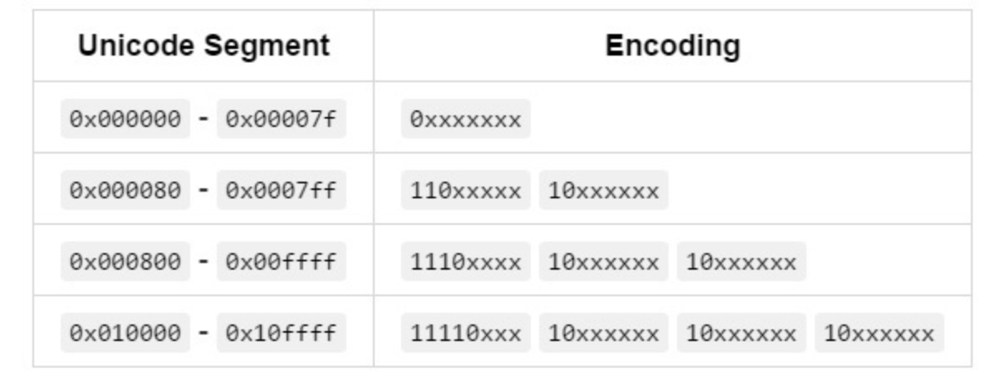

## 字节与字符

换算公式: `1byte = 8bit`

- ASCII 码中，一个英文字母（不分大小写）为一个字节，一个中文汉字为两个字节。
- UTF-8 编码中，一个英文字为一个字节，一个中文为三个字节。
- Unicode 编码中，一个英文为一个字节，一个中文为两个字节。
- 符号：英文标点为一个字节，中文标点为两个字节。例如：英文句号  .  占 1 个字节的大小，中文句号  。占 2 个字节的大小。
- UTF-16 编码中，一个英文字母字符或一个汉字字符存储都需要 2 个字节（Unicode 扩展区的一些汉字存储需要 4 个字节）。
- UTF-32 编码中，世界上任何字符的存储都需要 4 个字节。



## javascript 实现编码集转换

### javascript 进制

```js
// 事先介绍的方法 Number() 可以将其他进制的数字转化成10进制

// 例如:

Number(0b1111) // 15

// + 也是如此

console.log(+0b1111) // 15

// Number.prototype.toString(radix)

// 支持传入一个进制基数，用于将数字转换成对应进制的字符串，它支持转换小数。

// 未指定默认值为 10，基数参数的范围 2-36，超过范围，报错：RangeError。
;(0b1111).toString(16) // f
```

### 10 进制转 16 进制

```js
Number.prototype.toString.call(number, 16)
```

### 2 进制转 10 进制

```js
Number(0b1111)
```

## 实现 utf-8 到 16 进制的转换

```js
// 16进制转10进制
function utf16ToNumber(utf16) {
  return Number.parseInt(utf16, 16)
}
// 10进制转2进制
function numberTo2Int(number) {
  return Number(number).toString(2)
}

function int2ToUtf8(number) {
  const int2 = numberTo2Int(number)
  // 判断字段的边界情况
  let result = []
  let num,
    regExp = /(?=(?:\d{6})+$)/
  if (number > 0x10ffff || number < 0x000000) {
    throw Error('number invalid')
  } else if (number > 0x000000 && number <= 0x7f) {
    // 0xxxxxxx
    result.push(Number.parseInt(String(int2).padStart(8, '0'), 2))
  } else if (number > 0x7f && number <= 0x07ff) {
    //  110xxxxx 10xxxxxx
    num = String(int2).padStart(11, '0')
  } else if (number > 0x07ff && number <= 0xffff) {
    // 1110xxxx 10xxxxxx 10xxxxxx
    num = String(int2).padStart(16, '0')
  } else {
    // 11110xxx 10xxxxxx 10xxxxxx 10xxxxxx
    num = String(int2).padStart(21, '0')
  }
  if (num) {
    result = num.split(regExp).map((val) => {
      const in2 =
        val.length === 3
          ? `11110${val}`
          : val.length === 4
          ? `1110${val}`
          : val.length === 5
          ? `110${val}`
          : `10${val}`
      return Number(in2, 2)
    })
  }
  return result.map((val) => Number(`0b${val}`).toString(16))
}

// unicode 编码转成16进制的方式
function unicodeToBuffer(string) {
  const str = escape(string)
  let number = 0
  if (/%u/.test(str)) {
    // 10 进制的number
    number = utf16ToNumber(str.split(/\u/).slice(-1))
  } else {
    number = str.charCodeAt(0)
  }
  // 10进制转成16进制的utf8
  return int2ToUtf8(number)
}
```

## 参考资料

- <https://zhuanlan.zhihu.com/p/51202412>
- <https://www.ruanyifeng.com/blog/2007/10/ascii_unicode_and_utf-8.html>
